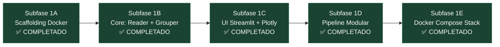

# Plan de Implementación: Fase 1 — Event Analyzer (Visualizador Sísmico Web) [100% COMPLETADO]

**Fecha**: 2026-07-24  
**Repositorio**: `RSA-Intern-TIG-MQTT`  
**Blueprint base**: [2026-07-24_event-analyzer-phase1-blueprint.md](file:///home/rsa/git/montajes/server-ubuntu/rsa/RSA-Intern-TIG-MQTT/docs/blueprints/2026-07-24_event-analyzer-phase1-blueprint.md)  

---

## Resumen Ejecutivo

La **Fase 1 (Visualizador Web de Eventos Sísmicos en Streamlit + ObsPy + Plotly)** ha sido **desarrollada, optimizada e integrada al 100%** a través de **5 subfases**. La aplicación permite inspeccionar eventos sísmicos regionales alineados temporalmente en UTC, aplicar detrending/filtrado pasabanda Butterworth y explorar las 3 componentes (Z, N, E) de múltiples estaciones en una interfaz web containerizada expuesta en el puerto `8501`.

---

## Árbol de Archivos Final (Fase 1 Completa)

```text
RSA-Intern-TIG-MQTT/
└── services/
    ├── docker-unified/
    │   └── docker-compose.yml               [MODIFICADO] Integración del servicio 'event-analyzer'
    └── event-analyzer/                       [CREADO]
        ├── Dockerfile                        [COMPLETADO - Subfase 1A] Python 3.11-slim + ObsPy + Streamlit
        ├── requirements.txt                  [COMPLETADO - Subfase 1A] Dependencias pinneadas
        ├── .streamlit/
        │   └── config.toml                   [COMPLETADO - Subfase 1C] Tema oscuro RSA y configuración UI
        ├── app.py                            [COMPLETADO - Subfase 1C] Punto de entrada Streamlit UI
        └── src/
            ├── __init__.py                   [COMPLETADO - Subfase 1A]
            ├── core/
            │   ├── __init__.py               [COMPLETADO - Subfase 1B]
            │   ├── reader.py                 [COMPLETADO - Subfase 1B] Ingestor ultrarrápido por Regex
            │   └── event_grouper.py          [COMPLETADO - Subfase 1B] Agrupador UTC con Lazy Loading
            ├── modules/
            │   ├── __init__.py               [COMPLETADO - Subfase 1D]
            │   ├── base.py                   [COMPLETADO - Subfase 1D] Clase abstracta BaseAnalysisModule
            │   └── visualizer.py             [COMPLETADO - Subfase 1D] Renderizador Plotly + Pipeline DSP
            └── utils/
                ├── __init__.py               [COMPLETADO - Subfase 1B]
                └── time_utils.py             [COMPLETADO - Subfase 1B] Formateo UTC y utilidades de tiempo
```

---

## Estado de Subfases de Implementación

| Subfase | Componente / Entregable | Estado |
|---------|-------------------------|--------|
| **Subfase 1A** | **Scaffolding Docker**: `Dockerfile`, `requirements.txt`, `app.py` inicial. | ✅ **COMPLETADO** |
| **Subfase 1B** | **Core Reader & Grouper**: Ingesta por regex (`MseedReader`), agrupamiento UTC (`EventGrouper`) y *Lazy Loading*. | ✅ **COMPLETADO** |
| **Subfase 1C** | **UI Streamlit & Plotly**: Tema oscuro, barra lateral, métricas (PGA Z, duración) y gráficos interactivos por estación/canal. | ✅ **COMPLETADO** |
| **Subfase 1D** | **Pipeline Modular**: Abstracción `BaseAnalysisModule`, refactor de `WaveformVisualizer` y corrección de DSP (`detrend("demean")`). | ✅ **COMPLETADO** |
| **Subfase 1E** | **Integración Docker Compose**: Adición de `event-analyzer` en `services/docker-unified/docker-compose.yml`. | ✅ **COMPLETADO** |

---

## Secuencia Final de Arquitectura



---

## Instrucciones de Despliegue en Producción

Para desplegar el stack completo unificado (InfluxDB, Telegraf, Grafana, Correlador y Event Analyzer):

```bash
cd services/docker-unified
docker compose up -d --build event-analyzer
```

Acceso al servicio: **`http://<IP_SERVIDOR>:8501`**
