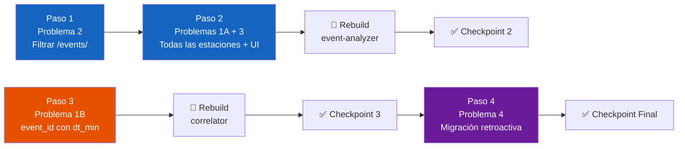

# 🗺️ Plan de Implementación: Corrección de Event Analyzer y Correlador Regional

**Fecha**: 2026-08-21  
**Referencia**: Diagnóstico de Resolución de Trazas MiniSEED e IDs Temporales  
**Directorio de trabajo**: `montajes/server-ubuntu/rsa/RSA-Intern-TIG-MQTT`

---

## 📐 Orden de Ejecución y Dependencias

Los pasos siguen un orden estricto por dependencias técnicas:



> [!IMPORTANT]
> **El Paso 1 es prerrequisito del Paso 2**: Si habilitamos la búsqueda en todas las estaciones sin antes filtrar `/mseed/`, el sistema cargaría datos de registro continuo de 6 estaciones en vez de 2 — empeorando el problema original.

> [!NOTE]
> Los Pasos 1-2 (Event Analyzer) y el Paso 3 (Correlador) modifican servicios distintos. Se pueden desarrollar en paralelo, pero deben verificarse por separado.

---

## Paso 1 — Filtrar búsqueda a subcarpeta `/events/` (Problema 2)

**Archivo**: [`services/event-analyzer/src/core/reader.py`](file:///home/rsa/git/montajes/server-ubuntu/rsa/RSA-Intern-TIG-MQTT/services/event-analyzer/src/core/reader.py)

### Cambios

1. **Método `scan_event()` (L126-133)**: Cambiar los patrones glob para buscar exclusivamente en `*/events/*.mseed`:
   ```diff
    for d_str in date_candidates:
        pats = [
   -        os.path.join(self.data_dir, "**", f"*{d_str}*.mseed"),
   -        os.path.join(self.data_dir, "**", f"*{d_str}*.MSEED")
   +        os.path.join(self.data_dir, "*", "events", f"*{d_str}*.mseed"),
   +        os.path.join(self.data_dir, "*", "events", f"*{d_str}*.MSEED")
        ]
   +    for p in pats:
   +        for fp in glob.glob(p):
   +            found_paths.add(fp)
   ```
   > El cambio de `**` con `recursive=True` a `*` sin recursión es intencional: la estructura es fija (`ESTACION/events/archivo.mseed`), no hay subdirectorios anidados.

2. **Método `scan()` (L40-45)**: Aplicar el mismo filtro para mantener consistencia en el modo fallback de disco:
   ```diff
   -pattern_lower = os.path.join(self.data_dir, "**", "*.mseed")
   -pattern_upper = os.path.join(self.data_dir, "**", "*.MSEED")
   -filepaths = glob.glob(pattern_lower, recursive=True)
   -filepaths.extend(glob.glob(pattern_upper, recursive=True))
   +pattern_lower = os.path.join(self.data_dir, "*", "events", "*.mseed")
   +pattern_upper = os.path.join(self.data_dir, "*", "events", "*.MSEED")
   +filepaths = glob.glob(pattern_lower)
   +filepaths.extend(glob.glob(pattern_upper))
   ```

### ✅ Checkpoint 1

Aún no se reconstruye el contenedor. Verificación visual del código:
- Confirmar que ambos métodos (`scan()` y `scan_event()`) usan el patrón `*/events/*.mseed`.
- Confirmar que no queda ninguna referencia a `**` con `recursive=True` en los glob de búsqueda de archivos.

---

## Paso 2 — Buscar trazas de todas las estaciones + indicadores UI (Problemas 1A y 3)

**Archivo**: [`services/event-analyzer/app.py`](file:///home/rsa/git/montajes/server-ubuntu/rsa/RSA-Intern-TIG-MQTT/services/event-analyzer/app.py)

### Cambios

1. **Resolución de trazas sin filtro de estaciones (L249-254)**:
   ```diff
    reader = MseedReader(data_dir=data_dir)
    ref_dt = selected_event_dict.get("reference_time_utc") or datetime.now(timezone.utc)
   -stations_target = selected_event_dict.get("stations", [])
   +# Estaciones que dispararon la correlación (dato informativo para metadatos)
   +detecting_stations = selected_event_dict.get("stations", [])
   
    with st.spinner("Buscando trazas sísmicas MiniSEED bajo demanda..."):
   -    matched_event_files = reader.scan_event(ref_time=ref_dt, stations=stations_target, window_s=120.0)
   +    matched_event_files = reader.scan_event(ref_time=ref_dt, stations=None, window_s=120.0)
   ```

2. **Etiqueta del selector de eventos (L222)** — Cambiar `est.` por `det.` para indicar "estaciones detectoras":
   ```diff
   -    return f"{icon} {time_str} ({evt['n_stations']} est.) — {evt_id}"
   +    return f"{icon} {time_str} ({evt['n_stations']} det.) — {evt_id}"
   ```

3. **Métricas de cabecera (L376-379)** — Diferenciar estaciones detectoras vs resueltas:
   ```diff
   -col_m2.metric("📡 Estaciones Seleccionadas", f"{len(active_stations)} / {len(available_stations)}", f"Estaciones: {', '.join(active_stations)}")
   +col_m2.metric("📡 Estaciones Resueltas", f"{len(active_stations)} / {len(available_stations)}", f"Detectoras: {', '.join(detecting_stations)}")
   ```

4. **Mensaje de advertencia cuando no hay trazas (L404)** — Actualizar referencia a la variable renombrada:
   ```diff
   -    st.warning(f"⚠️ No se encontraron archivos `.mseed` locales para las estaciones ({', '.join(stations_target)}) ...")
   +    st.warning(f"⚠️ No se encontraron archivos `.mseed` locales en la ventana temporal de {ref_dt.strftime('%Y-%m-%d %H:%M UTC')}.")
   ```

5. **Sección de metadatos (L416)** — Actualizar para usar la variable renombrada:
   ```diff
   -    st.write(f"**Estaciones Participantes**: {selected_event_dict.get('stations_str', ', '.join(stations_target))}")
   +    st.write(f"**Estaciones Detectoras (Correlación)**: {selected_event_dict.get('stations_str', ', '.join(detecting_stations))}")
   ```

### ✅ Checkpoint 2

Reconstruir el contenedor de Event Analyzer y verificar en la interfaz web. Ejecutar manualmente en el servidor remoto:

```bash
cd /home/rsa/git/montajes/server-ubuntu/rsa/RSA-Intern-TIG-MQTT/services/docker-unified
docker compose up -d --build event-analyzer
```

**Verificaciones en `http://<IP>:8501`**:

1. Seleccionar un evento cualquiera del día 2026-08-19 y confirmar que:
   - [ ] El selector muestra `(2 det.)` en vez de `(2 est.)`.
   - [ ] La sección de trazas resueltas muestra archivos de **todas las estaciones** (CHA1, CHA2, DEV0, DEV01, FERR, TENG), no solo las 2 detectoras.
   - [ ] Todos los archivos mostrados provienen de la ruta `*/events/*.mseed` (ninguno de `/mseed/`).
   - [ ] La métrica "Estaciones Resueltas" muestra `6/6` (o la cantidad real disponible).
   - [ ] La métrica "Detectoras:" muestra solo las estaciones que correlacionaron (ej. `CHA2, DEV0`).
   - [ ] Las formas de onda se renderizan correctamente para las 6 estaciones.

2. Seleccionar el multiselect de estaciones en la barra lateral y confirmar que:
   - [ ] Las 6 estaciones aparecen como opciones seleccionables.
   - [ ] Al deseleccionar una estación, su forma de onda desaparece del gráfico.

---

## Paso 3 — Corregir `event_id` en el Correlador (Problema 1B)

**Archivo**: [`scripts/correlator/regional_event_correlator.py`](file:///home/rsa/git/montajes/server-ubuntu/rsa/RSA-Intern-TIG-MQTT/scripts/correlator/regional_event_correlator.py)

### Cambios

1. **Generación del `event_id` (L294)** — Usar `dt_min` en vez de `datetime.now()`:
   ```diff
   -req_id = f"corr-{datetime.now(timezone.utc).strftime('%Y%m%d-%H%M%S')}"
   +req_id = f"corr-{dt_min.strftime('%Y%m%d-%H%M%S')}"
   ```

### ✅ Checkpoint 3

Reconstruir el contenedor del correlador y esperar a que ocurra un evento real (o simular uno). Ejecutar manualmente:

```bash
cd /home/rsa/git/montajes/server-ubuntu/rsa/RSA-Intern-TIG-MQTT/services/docker-unified
docker compose up -d --build correlator
```

**Verificación tras el siguiente evento correlado**:

1. Consultar en InfluxDB el evento más reciente:
   ```bash
   docker exec -i rsa-influxdb influx query '
   from(bucket: "rsa_events")
     |> range(start: -1h)
     |> filter(fn: (r) => r._measurement == "seismic_event" and r._field == "stations")
     |> keep(columns: ["_time", "event_id"])
     |> sort(columns: ["_time"], desc: true)
     |> limit(n: 1)
   ' --org rsa
   ```

2. Confirmar que:
   - [ ] El sufijo del `event_id` (ej. `corr-YYYYMMDD-HHMMSS`) coincide con el `_time` de InfluxDB (misma hora, minuto y segundo).
   - [ ] En el Event Analyzer, el selector muestra el mismo tiempo en ambos campos: `🤖 HH:MM:SS UTC (2 det.) — corr-YYYYMMDD-HHMMSS`.

---

## Paso 4 — Migración retroactiva de `event_id` existentes (Problema 4)

**Archivo nuevo**: `scripts/db_sync/fix_event_ids.py`

### Prerrequisitos

- [ ] Paso 3 completado y verificado (el correlador ya genera IDs correctos).
- [ ] Backup del bucket `rsa_events` ejecutado como red de seguridad (si ya existe `backup_events.sh` de la Fase 5, usarlo; si no, ejecutar manualmente):
  ```bash
  docker exec rsa-influxdb influx backup /tmp/rsa_events_backup --bucket rsa_events --org rsa
  docker cp rsa-influxdb:/tmp/rsa_events_backup ./rsa_events_backup_pre_migration
  ```

### Lógica del Script

1. Conectar al bucket `rsa_events` con la API de InfluxDB v2.
2. Consultar **todos** los eventos con `event_id` que empiece por `corr-`.
3. Para cada evento:
   - Extraer `_time` (= `timestamp_utc` original de la detección).
   - Calcular el nuevo `event_id`: `corr-{_time.strftime('%Y%m%d-%H%M%S')}`.
   - Si el nuevo ID difiere del actual:
     - Eliminar el punto original usando la API `delete` con predicado sobre `event_id`.
     - Reinsertar el punto con el `event_id` corregido y todos los demás Tags y Fields intactos.
4. Registrar un log de cambios: `{event_id_viejo} → {event_id_nuevo}`.

> [!CAUTION]
> Los eventos de tipo `manual` (source: `nodered`) y los de tipo `confirmed`/`discarded` (source: `event_analyzer`) **no deben migrar** si su `event_id` no sigue el patrón `corr-*`. Solo se migran los eventos con prefijo `corr-`.

### ✅ Checkpoint 4 (Final)

Ejecutar el script desde el servidor y verificar:

```bash
cd /home/rsa/git/montajes/server-ubuntu/rsa/RSA-Intern-TIG-MQTT
python3 scripts/db_sync/fix_event_ids.py
```

**Verificaciones**:

1. Consultar un día con eventos conocidos (ej. 2026-08-19):
   ```bash
   docker exec -i rsa-influxdb influx query '
   from(bucket: "rsa_events")
     |> range(start: 2026-08-19T00:00:00Z, stop: 2026-08-19T23:59:59Z)
     |> filter(fn: (r) => r._measurement == "seismic_event" and r._field == "stations")
     |> keep(columns: ["_time", "event_id"])
     |> sort(columns: ["_time"])
     |> limit(n: 5)
   ' --org rsa
   ```

2. Confirmar que:
   - [ ] El primer evento que antes era `corr-20260819-000603` (procesamiento a las 00:06:03) ahora es `corr-20260819-000552` (detección a las 00:05:52).
   - [ ] Los sufijos de todos los `event_id` coinciden exactamente con sus respectivos `_time`.
   - [ ] La cantidad total de eventos se conserva (no se perdieron ni duplicaron registros).

3. Verificar en Event Analyzer (`http://<IP>:8501`):
   - [ ] Los eventos del día se cargan correctamente con los nuevos IDs.
   - [ ] El selector muestra tiempos coherentes: `🤖 00:05:52 UTC (2 det.) — corr-20260819-000552`.

---

## 📊 Resumen del Plan

| Paso | Problema | Archivo(s) | Contenedor a reconstruir | Dependencia |
|------|----------|------------|--------------------------|-------------|
| 1 | P2 — Filtrar `/events/` | `reader.py` | — (no rebuild aún) | Ninguna |
| 2 | P1A + P3 — Todas las estaciones + UI | `app.py` | `event-analyzer` | Paso 1 |
| 3 | P1B — `event_id` con `dt_min` | `regional_event_correlator.py` | `correlator` | Ninguna |
| 4 | P4 — Migración retroactiva | `fix_event_ids.py` (nuevo) | — (script puntual) | Paso 3 |
