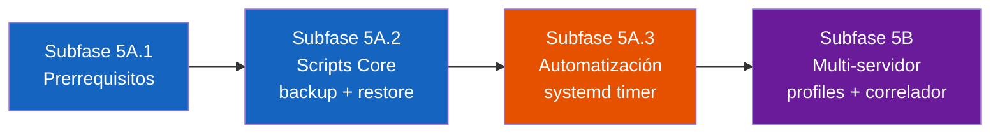

# 🗺️ Plan de Implementación: Fase 5 — Protocolo de Respaldo y Recuperación

**Fecha**: 2026-08-26  
**Referencia**: [Diagnóstico Técnico Fase 5](file:///home/rsa/.gemini/antigravity-ide/brain/2b88c886-9a35-4e21-a243-75d9814b010c/diagnostico_fase5_respaldo_recuperacion.md)  
**Directorio de trabajo**: `montajes/server-ubuntu/rsa/RSA-Intern-TIG-MQTT`

---

## 📐 Estructura de Subfases y Dependencias



> [!IMPORTANT]
> **Restricción SSHFS**: Los archivos del directorio de trabajo están montados vía SSHFS. **No se ejecutan comandos autónomos** en esta ruta. Todos los comandos de ejecución se proporcionan como texto para que el usuario los ejecute manualmente en el servidor remoto.

---

## 📋 Resumen de Decisiones Vigentes

| Decisión | Elección |
|---|---|
| Alcance | Solo bucket `rsa_events` |
| Herramienta | `influx backup` + CSV complementario |
| Frecuencia | Diaria a las 02:00 UTC |
| Retención | 7 días con rotación automática |
| Programación | `systemd timer` + `systemd service` |
| Notificación MQTT | Vía `paho-mqtt` en entorno virtual (no `mosquitto_pub`) |
| Rol del home-server | Espejo pasivo + clasificación manual tipo 3/4 |
| Correlador | Solo en rsa-server (Opción C: detecciones retenidas por broker) |
| Activación | Docker Compose `profiles` |

---

## 📂 Archivos a Crear y Modificar

### Archivos Nuevos

| Archivo | Subfase | Descripción |
|---|---|---|
| `scripts/db_sync/Dockerfile` | 5A.1 | Imagen Docker para notificación MQTT (Python 3.11-slim + paho-mqtt) |
| `scripts/db_sync/requirements.txt` | 5A.1 | Dependencias del contenedor (`paho-mqtt`, `python-dotenv`) |
| `scripts/db_sync/backup_events.sh` | 5A.2 | Script principal de respaldo (ejecuta en el host) |
| `scripts/db_sync/restore_events.sh` | 5A.2 | Script de restauración (ejecuta en el host) |
| `scripts/db_sync/mqtt_notify.py` | 5A.2 | Helper Python para notificación MQTT (ejecuta dentro del contenedor `rsa-db-sync`) |
| `services/systemd/rsa-backup-events.service` | 5A.3 | Unidad systemd del backup |
| `services/systemd/rsa-backup-events.timer` | 5A.3 | Timer systemd (02:00 UTC diario) |

### Archivos a Modificar

| Archivo | Subfase | Cambio |
|---|---|---|
| `services/docker-unified/docker-compose.yml` | 5A.1 | Agregar servicio `db-sync` (utilidad bajo demanda, sin `restart`) |
| `services/docker-unified/.env.example` | 5B | Agregar `RSA_SERVER_ROLE`, `RSA_CORRELATOR_CLIENT_ID` |
| `services/docker-unified/docker-compose.yml` | 5B | Agregar `profiles: ["primary"]` al servicio `correlator` |
| `scripts/correlator/regional_event_correlator.py` | 5B | `client_id` fijo + `clean_session=False` |

---

## Subfase 5A.1 — Prerrequisitos

**Objetivo**: Verificar dependencias del host y crear el contenedor Docker portátil para notificación MQTT.

### Acciones

#### 1. Verificar `rclone` y el remote de Google Drive

El usuario debe ejecutar en **rsa-server**:

```bash
# Verificar que rclone está instalado
rclone version

# Listar remotes configurados (debe aparecer 'gdrive:' o el nombre del remote)
rclone listremotes

# Verificar acceso a Drive
rclone lsd gdrive:
```

#### 2. Crear la carpeta de backups en Google Drive

```bash
rclone mkdir gdrive:RSA-Backups/influxdb
```

#### 3. Crear el contenedor Docker `rsa-db-sync`

En lugar de un entorno virtual Python (no portable entre servidores), se utiliza un contenedor Docker ligero siguiendo el mismo patrón del [correlador](file:///home/rsa/git/montajes/server-ubuntu/rsa/RSA-Intern-TIG-MQTT/scripts/correlator/Dockerfile). Esto garantiza que cualquier servidor nuevo pueda ejecutar los scripts de backup con un solo `docker compose build`.

**Archivo**: `scripts/db_sync/requirements.txt`

```
paho-mqtt>=1.6.1
python-dotenv>=1.0.0
```

**Archivo**: `scripts/db_sync/Dockerfile`

```dockerfile
FROM python:3.11-slim

WORKDIR /app

# Instalar dependencias
COPY requirements.txt .
RUN pip install --no-cache-dir -r requirements.txt

# Copiar scripts Python
COPY mqtt_notify.py .

# Ejecución en modo unbuffered para salida inmediata de logs
ENTRYPOINT ["python", "-u"]
CMD ["mqtt_notify.py", "--help"]
```

> [!NOTE]
> El `ENTRYPOINT` es `python -u` y el `CMD` por defecto muestra la ayuda. Los scripts bash del host invocan el contenedor mediante `docker compose run --rm db-sync mqtt_notify.py --status success ...`, donde los argumentos sustituyen al `CMD`.

**Agregar el servicio `db-sync` a Docker Compose**:

**Archivo**: [`services/docker-unified/docker-compose.yml`](file:///home/rsa/git/montajes/server-ubuntu/rsa/RSA-Intern-TIG-MQTT/services/docker-unified/docker-compose.yml)

Agregar antes de la sección de redes:

```yaml
  # ============================================================================
  # DB Sync - Utilidades de Respaldo y Notificación MQTT (bajo demanda)
  # ============================================================================
  db-sync:
    build:
      context: ../../scripts/db_sync
      dockerfile: Dockerfile
    container_name: rsa-db-sync
    # No tiene 'restart': este contenedor se ejecuta bajo demanda con 'docker compose run'
    environment:
      - MQTT_BROKER=${MQTT_BROKER}
      - MQTT_PORT=${MQTT_PORT:-1883}
      - MQTT_USERNAME=${MQTT_USERNAME}
      - MQTT_PASSWORD=${MQTT_PASSWORD}
      - TELEGRAF_CLIENT_ID=${TELEGRAF_CLIENT_ID:-events-server}
    networks:
      - monitoring
```

> [!IMPORTANT]
> **Arquitectura de ejecución**:
> - `backup_events.sh` y `restore_events.sh` se ejecutan **en el host** porque necesitan `docker exec` (para la CLI de InfluxDB), `docker cp` (para copiar snapshots) y `rclone` (para subir a Drive).
> - `mqtt_notify.py` se ejecuta **dentro del contenedor `rsa-db-sync`** vía `docker compose run --rm db-sync mqtt_notify.py ...`. Esto elimina la necesidad de instalar Python o dependencias en el host.
> - El contenedor `rsa-db-sync` no corre permanentemente (`restart` no está definido). Solo se instancia bajo demanda y se destruye inmediatamente (`--rm`).

El usuario debe construir la imagen tras crear los archivos:

```bash
cd /home/rsa/git/rsa/RSA-Intern-TIG-MQTT/services/docker-unified
docker compose build db-sync
```

#### 4. Verificar permisos Docker del usuario

```bash
# Verificar que el usuario puede ejecutar docker sin sudo
docker ps

# Si falla, agregar al grupo docker:
# sudo usermod -aG docker $USER
# (requiere cerrar sesión y volver a entrar)
```

#### 5. Verificar que el contenedor InfluxDB está corriendo y la CLI funciona

```bash
docker exec rsa-influxdb influx ping
docker exec rsa-influxdb influx bucket list --org rsa --token "$(grep INFLUXDB_TOKEN /home/rsa/git/rsa/RSA-Intern-TIG-MQTT/services/docker-unified/.env | cut -d= -f2)"
```

### ✅ Checkpoint 5A.1

| # | Verificación | Criterio |
|---|---|---|
| C1 | `rclone` operativo | `rclone lsd gdrive:` lista directorios sin error |
| C2 | Carpeta en Drive | `rclone lsd gdrive:RSA-Backups/` muestra `influxdb/` |
| C3 | Imagen Docker construida | `docker compose build db-sync` completa sin errores |
| C4 | Contenedor funcional | `docker compose run --rm db-sync mqtt_notify.py --help` muestra la ayuda del script |
| C5 | Docker sin sudo | `docker ps` lista contenedores sin error |
| C6 | InfluxDB CLI | `docker exec rsa-influxdb influx ping` retorna `OK` |

---

## Subfase 5A.2 — Scripts Core (Backup + Restore)

**Objetivo**: Crear los scripts de respaldo y restauración con notificación MQTT.

### Acción 1 — Script `mqtt_notify.py`

**Archivo**: `scripts/db_sync/mqtt_notify.py`  
**Propósito**: Helper Python que se ejecuta dentro del contenedor `rsa-db-sync` para publicar el resultado vía MQTT usando `paho-mqtt`. Invocado desde `backup_events.sh` mediante `docker compose run --rm db-sync mqtt_notify.py ...`.

**Interfaz CLI**:
```
mqtt_notify.py --status success|failure \
               --events-count N \
               --snapshot-size BYTES \
               --csv-size BYTES \
               --backup-file FILENAME \
               --duration SECONDS \
               [--error-message "TEXT"] \
               [--purged-count N]
```

**Comportamiento**:
1. Carga las variables de entorno desde el `.env` más cercano (`../docker-unified/.env` o `../../services/docker-unified/.env`).
2. Construye el payload JSON:
   ```json
   {
     "source": "backup_events",
     "server": "${TELEGRAF_CLIENT_ID}",
     "status": "success",
     "timestamp_utc": "2026-08-26T02:00:15Z",
     "snapshot_size_bytes": 524288,
     "csv_size_bytes": 32768,
     "events_count": 172,
     "backup_file": "rsa_events_2026-08-26.tar.gz",
     "drive_path": "RSA-Backups/influxdb/",
     "purged_count": 1,
     "duration_s": 4.2,
     "error_message": null
   }
   ```
3. Publica al tópico `rsa/seismic/smart/system/backup` con QoS 1.
4. Desconecta y sale con código 0 (éxito) o 1 (fallo en publicación).

> [!NOTE]
> Todos los campos del payload se derivan de argumentos CLI o variables de entorno. **Ningún valor está hardcodeado**. `TELEGRAF_CLIENT_ID` se lee del `.env` para identificar el servidor.

### Acción 2 — Script `backup_events.sh`

**Archivo**: `scripts/db_sync/backup_events.sh`

**Variables de entorno requeridas** (leídas de `.env`):

| Variable | Fuente | Ejemplo |
|---|---|---|
| `INFLUXDB_TOKEN` | `.env` | `my-super-secret-auth-token...` |
| `INFLUXDB_ORG` | `.env` | `rsa` |
| `INFLUXDB_EVENTS_BUCKET` | `.env` | `rsa_events` |
| `TELEGRAF_CLIENT_ID` | `.env` | `events-server` |
| `RCLONE_REMOTE` | `.env` o default | `gdrive:RSA-Backups/influxdb` |

**Argumentos CLI opcionales**:

| Argumento | Default | Descripción |
|---|---|---|
| `--dry-run` | `false` | Ejecuta todo excepto subir a Drive y purgar |
| `--retention-days` | `7` | Días de retención antes de purgar |
| `--env-file` | Auto-detectado | Ruta al archivo `.env` |

**Flujo paso a paso**:

```bash
#!/usr/bin/env bash
set -euo pipefail

# === 1. Configuración ===
SCRIPT_DIR="$(cd "$(dirname "${BASH_SOURCE[0]}")" && pwd)"
ENV_FILE="${ENV_FILE:-$SCRIPT_DIR/../../services/docker-unified/.env}"
COMPOSE_DIR="$SCRIPT_DIR/../../services/docker-unified"
DATE=$(date -u +%Y-%m-%d)
BACKUP_NAME="rsa_events_${DATE}"
TMP_DIR="/tmp/rsa_backup_$$"
RETENTION_DAYS="${1:-7}"
CONTAINER="rsa-influxdb"
START_TIME=$(date +%s)

# === 2. Cargar .env ===
if [ -f "$ENV_FILE" ]; then
    set -a; source "$ENV_FILE"; set +a
fi

# === 3. Verificar contenedor ===
if ! docker inspect "$CONTAINER" --format='{{.State.Running}}' 2>/dev/null | grep -q true; then
    echo "[ERROR] Contenedor $CONTAINER no está corriendo."
    # Notificar fallo vía contenedor Docker
    docker compose -f "$COMPOSE_DIR/docker-compose.yml" run --rm db-sync \
        mqtt_notify.py --status failure \
        --error-message "Contenedor $CONTAINER no está corriendo"
    exit 1
fi

# === 4. Crear directorio temporal ===
mkdir -p "$TMP_DIR"

# === 5. Snapshot binario (influx backup) ===
docker exec "$CONTAINER" rm -rf /tmp/backup
docker exec "$CONTAINER" influx backup /tmp/backup \
    --bucket "${INFLUXDB_EVENTS_BUCKET:-rsa_events}" \
    --org "${INFLUXDB_ORG:-rsa}" \
    --token "${INFLUXDB_TOKEN}"
docker cp "$CONTAINER:/tmp/backup" "$TMP_DIR/snapshot"
tar czf "$TMP_DIR/${BACKUP_NAME}.tar.gz" -C "$TMP_DIR/snapshot" .

# === 6. Exportar CSV legible ===
FLUX_QUERY='from(bucket: "'"${INFLUXDB_EVENTS_BUCKET:-rsa_events}"'")
  |> range(start: 0)
  |> filter(fn: (r) => r._measurement == "seismic_event")
  |> pivot(rowKey: ["_time","event_id"], columnKey: ["_field"], valueColumn: "_value")'

docker exec "$CONTAINER" influx query "$FLUX_QUERY" \
    --org "${INFLUXDB_ORG:-rsa}" \
    --token "${INFLUXDB_TOKEN}" \
    --raw > "$TMP_DIR/${BACKUP_NAME}.csv"

# === 7. Contar eventos ===
EVENTS_COUNT=$(wc -l < "$TMP_DIR/${BACKUP_NAME}.csv")
EVENTS_COUNT=$((EVENTS_COUNT - 1))  # Descontar header
SNAPSHOT_SIZE=$(stat -c%s "$TMP_DIR/${BACKUP_NAME}.tar.gz")
CSV_SIZE=$(stat -c%s "$TMP_DIR/${BACKUP_NAME}.csv")

# === 8. Subir a Google Drive ===
RCLONE_DEST="${RCLONE_REMOTE:-gdrive:RSA-Backups/influxdb}"
rclone copy "$TMP_DIR/${BACKUP_NAME}.tar.gz" "$RCLONE_DEST/"
rclone copy "$TMP_DIR/${BACKUP_NAME}.csv" "$RCLONE_DEST/"

# === 9. Verificar subida ===
rclone ls "$RCLONE_DEST/${BACKUP_NAME}.tar.gz" > /dev/null

# === 10. Purgar backups antiguos ===
PURGED=0
rclone lsf "$RCLONE_DEST/" --files-only | while read -r fname; do
    # Extraer fecha del nombre: rsa_events_YYYY-MM-DD.{tar.gz,csv}
    fdate=$(echo "$fname" | grep -oP '\d{4}-\d{2}-\d{2}')
    if [ -n "$fdate" ]; then
        age_days=$(( ($(date -u +%s) - $(date -u -d "$fdate" +%s)) / 86400 ))
        if [ "$age_days" -gt "$RETENTION_DAYS" ]; then
            rclone deletefile "$RCLONE_DEST/$fname"
            PURGED=$((PURGED + 1))
        fi
    fi
done

# === 11. Calcular duración ===
END_TIME=$(date +%s)
DURATION=$((END_TIME - START_TIME))

# === 12. Notificar resultado vía MQTT (contenedor Docker) ===
docker compose -f "$COMPOSE_DIR/docker-compose.yml" run --rm db-sync \
    mqtt_notify.py \
    --status success \
    --events-count "$EVENTS_COUNT" \
    --snapshot-size "$SNAPSHOT_SIZE" \
    --csv-size "$CSV_SIZE" \
    --backup-file "${BACKUP_NAME}.tar.gz" \
    --duration "$DURATION" \
    --purged-count "$PURGED"

# === 13. Limpiar temporal ===
rm -rf "$TMP_DIR"
docker exec "$CONTAINER" rm -rf /tmp/backup

echo "[OK] Backup completado: ${BACKUP_NAME} ($EVENTS_COUNT eventos, ${SNAPSHOT_SIZE} bytes)"
```

> [!IMPORTANT]
> El flujo anterior es la especificación. La implementación real incluirá manejo de errores robusto con `trap` para limpiar `/tmp` ante fallos, y llamará a `mqtt_notify.py --status failure` en cada punto de falla.

### Acción 3 — Script `restore_events.sh`

**Archivo**: `scripts/db_sync/restore_events.sh`

**Argumentos CLI**:

| Argumento | Requerido | Descripción |
|---|---|---|
| `--date YYYY-MM-DD` | Sí (o `--latest`) | Fecha del backup a restaurar |
| `--latest` | Sí (o `--date`) | Descarga el backup más reciente de Drive |
| `--yes` | No | Omite confirmación interactiva (para automatización) |
| `--env-file` | No | Ruta al archivo `.env` |

**Flujo paso a paso**:

```
 1. Cargar variables desde .env
 2. Determinar el archivo a descargar:
    - Si --latest: listar archivos en Drive, ordenar por fecha, seleccionar el más reciente
    - Si --date: usar rsa_events_YYYY-MM-DD.tar.gz
 3. Descargar de Drive: rclone copy gdrive:RSA-Backups/influxdb/rsa_events_YYYY-MM-DD.tar.gz /tmp/
 4. Extraer: tar xzf ... -C /tmp/rsa_events_restore
 5. Copiar al contenedor: docker cp /tmp/rsa_events_restore rsa-influxdb:/tmp/restore_data

 6. ⚠️ CONFIRMACIÓN INTERACTIVA (a menos que --yes):
    "ADVERTENCIA: Se va a BORRAR el bucket 'rsa_events' y restaurarlo desde el backup del YYYY-MM-DD."
    "Eventos actuales en la base: N"
    "¿Continuar? [y/N]"

 7. Borrar bucket: docker exec rsa-influxdb influx bucket delete -n rsa_events -o rsa --token $TOKEN
 8. Restaurar: docker exec rsa-influxdb influx restore /tmp/restore_data --bucket rsa_events --org rsa --token $TOKEN
 9. Verificar integridad: consulta Flux de conteo
    docker exec rsa-influxdb influx query '
      from(bucket: "rsa_events")
        |> range(start: 0)
        |> filter(fn: (r) => r._measurement == "seismic_event" and r._field == "stations")
        |> count()
    ' --org rsa --token $TOKEN
10. Limpiar /tmp y contenedor
11. Imprimir resumen: "Restaurados N eventos desde backup del YYYY-MM-DD"
```

> [!WARNING]
> El paso 7 es **destructivo e irreversible**. Sin el flag `--yes`, el script siempre solicita confirmación interactiva mostrando la cantidad de eventos actuales que se perderán.

### ✅ Checkpoint 5A.2

Ejecutar manualmente en **rsa-server**:

| # | Verificación | Comando / Criterio |
|---|---|---|
| C7 | Backup manual exitoso | `bash scripts/db_sync/backup_events.sh` completa sin errores y muestra conteo de eventos |
| C8 | Archivos en Drive | `rclone ls gdrive:RSA-Backups/influxdb/` muestra `.tar.gz` y `.csv` del día |
| C9 | CSV legible | Abrir `rsa_events_YYYY-MM-DD.csv` y verificar columnas: `_time`, `event_id`, `event_type`, `source`, `stations`, `n_stations`, `duration_s` |
| C10 | Notificación MQTT | Ejecutar `mosquitto_sub -h $BROKER -u $USER -P $PASS -t "rsa/seismic/smart/system/backup" -C 1` en paralelo con el backup. Verificar que recibe JSON con `"status":"success"` y `"server":"events-server"` |
| C11 | Restauración destructiva | 1. Anotar conteo actual de eventos. 2. Ejecutar `bash scripts/db_sync/restore_events.sh --latest`. 3. Verificar que el conteo se restaura correctamente |
| C12 | Rotación (verificación manual) | Crear archivos ficticios con fecha >7 días en Drive, ejecutar backup, verificar que se purgan |

---

## Subfase 5A.3 — Automatización con systemd

**Objetivo**: Programar la ejecución diaria del backup a las 02:00 UTC mediante `systemd timer`.

### Acción 1 — Crear unidad de servicio

**Archivo**: `services/systemd/rsa-backup-events.service`

```ini
[Unit]
Description=RSA - Backup diario del catálogo de eventos sísmicos (InfluxDB rsa_events)
Documentation=file:///home/rsa/git/rsa/RSA-Intern-TIG-MQTT/docs/blueprints/2026-08-26_fase5_implementation_plan.md
Wants=docker.service
After=docker.service

[Service]
Type=oneshot
User=rsa
Group=rsa
WorkingDirectory=/home/rsa/git/rsa/RSA-Intern-TIG-MQTT/scripts/db_sync
ExecStart=/bin/bash /home/rsa/git/rsa/RSA-Intern-TIG-MQTT/scripts/db_sync/backup_events.sh
Environment=ENV_FILE=/home/rsa/git/rsa/RSA-Intern-TIG-MQTT/services/docker-unified/.env

# Timeout generoso para subida a Drive
TimeoutStartSec=300

# Logging
StandardOutput=journal
StandardError=journal
SyslogIdentifier=rsa-backup-events
```

### Acción 2 — Crear timer

**Archivo**: `services/systemd/rsa-backup-events.timer`

```ini
[Unit]
Description=RSA - Timer diario para backup de eventos sísmicos (02:00 UTC)

[Timer]
OnCalendar=*-*-* 02:00:00 UTC
Persistent=true
RandomizedDelaySec=300

[Install]
WantedBy=timers.target
```

> [!NOTE]
> `Persistent=true` garantiza que si el servidor estuvo apagado a las 02:00 UTC, el backup se ejecutará al encender. `RandomizedDelaySec=300` añade hasta 5 minutos de jitter para no sobrecargar el sistema exactamente a las 02:00.

### Acción 3 — Instalación en rsa-server

El usuario debe ejecutar:

```bash
# Copiar las unidades al directorio de systemd del usuario
sudo cp services/systemd/rsa-backup-events.service /etc/systemd/system/
sudo cp services/systemd/rsa-backup-events.timer /etc/systemd/system/

# Recargar systemd
sudo systemctl daemon-reload

# Habilitar el timer (persiste entre reinicios)
sudo systemctl enable rsa-backup-events.timer

# Iniciar el timer ahora
sudo systemctl start rsa-backup-events.timer

# Verificar estado
systemctl status rsa-backup-events.timer
systemctl list-timers --all | grep rsa
```

### Comandos de Operación

```bash
# Ver próxima ejecución programada
systemctl list-timers rsa-backup-events.timer

# Ejecutar manualmente (sin esperar al timer)
sudo systemctl start rsa-backup-events.service

# Ver logs de la última ejecución
journalctl -u rsa-backup-events.service -n 50 --no-pager

# Ver logs de todas las ejecuciones
journalctl -u rsa-backup-events.service --since "7 days ago"

# Deshabilitar temporalmente
sudo systemctl stop rsa-backup-events.timer

# Rehabilitar
sudo systemctl start rsa-backup-events.timer

# Desinstalar completamente
sudo systemctl disable rsa-backup-events.timer
sudo rm /etc/systemd/system/rsa-backup-events.*
sudo systemctl daemon-reload
```

### ✅ Checkpoint 5A.3

| # | Verificación | Criterio |
|---|---|---|
| C13 | Timer registrado | `systemctl status rsa-backup-events.timer` muestra `active (waiting)` y la próxima fecha de ejecución |
| C14 | Ejecución manual | `sudo systemctl start rsa-backup-events.service` completa exitosamente (verificar con `journalctl -u rsa-backup-events.service -n 20`) |
| C15 | Logs en journalctl | La salida del script aparece correctamente en `journalctl` con el identificador `rsa-backup-events` |
| C16 | Ejecución automática | Esperar a la próxima ejecución programada (o modificar temporalmente `OnCalendar` a los próximos 5 minutos) y verificar que el backup aparece en Drive |

---

## Subfase 5B — Configuración Multi-Servidor

**Objetivo**: Preparar la infraestructura para que rsa-server y home-server operen coordinadamente con un único correlador activo y sesiones persistentes.

> [!IMPORTANT]
> Esta subfase se ejecuta **después** de validar la Fase 5A completa. No bloquea la puesta en producción del backup.

### Acción 1 — Agregar variables de entorno a `.env.example`

**Archivo**: [`services/docker-unified/.env.example`](file:///home/rsa/git/montajes/server-ubuntu/rsa/RSA-Intern-TIG-MQTT/services/docker-unified/.env.example)

Agregar al final del archivo:

```env
# ==============================================================================
# Server Role Configuration
# ==============================================================================
# Rol del servidor en la arquitectura multi-servidor RSA.
# - "primary": Ejecuta el correlador activo. Solo un servidor debe tener este rol.
# - "mirror": Espejo pasivo. No ejecuta el correlador. Visualización y clasificación.
RSA_SERVER_ROLE=primary

# Client ID fijo para sesión persistente del correlador en Mosquitto.
# Debe ser único por servidor y NO cambiar entre reinicios.
RSA_CORRELATOR_CLIENT_ID=rsa-correlator-primary

# Remote de rclone para backups (nombre del remote + ruta)
RCLONE_REMOTE=gdrive:RSA-Backups/influxdb
```

**Valores por servidor**:

| Variable | rsa-server | home-server |
|---|---|---|
| `TELEGRAF_CLIENT_ID` | `events-server` | `events-home` |
| `RSA_SERVER_ROLE` | `primary` | `mirror` |
| `RSA_CORRELATOR_CLIENT_ID` | `rsa-correlator-primary` | *(no aplica)* |

### Acción 2 — Agregar `profiles` a Docker Compose

**Archivo**: [`services/docker-unified/docker-compose.yml`](file:///home/rsa/git/montajes/server-ubuntu/rsa/RSA-Intern-TIG-MQTT/services/docker-unified/docker-compose.yml)

Cambio en el servicio `correlator`:

```diff
   correlator:
+    profiles:
+      - primary
     build:
       context: ../../scripts/correlator
       dockerfile: Dockerfile
     container_name: rsa-correlator
     restart: unless-stopped
     environment:
       - MQTT_BROKER=${MQTT_BROKER}
       - MQTT_PORT=${MQTT_PORT:-1883}
       - MQTT_USERNAME=${MQTT_USERNAME}
       - MQTT_PASSWORD=${MQTT_PASSWORD}
+      - RSA_CORRELATOR_CLIENT_ID=${RSA_CORRELATOR_CLIENT_ID:-rsa-correlator-primary}
     networks:
       - monitoring
```

### Acción 3 — Modificar correlador para sesión persistente

**Archivo**: [`scripts/correlator/regional_event_correlator.py`](file:///home/rsa/git/montajes/server-ubuntu/rsa/RSA-Intern-TIG-MQTT/scripts/correlator/regional_event_correlator.py)

Cambios en el método `iniciar()` (líneas 104-111):

```diff
-        # Client ID único para evitar colisiones en Mosquitto
-        client_suffix = uuid.uuid4().hex[:6]
-        client_id = f"rsa_correlator_{socket.gethostname()}_{client_suffix}"
+        # Client ID fijo para sesión persistente en Mosquitto.
+        # Permite que el broker retenga mensajes durante cortes de energía.
+        client_id = os.getenv("RSA_CORRELATOR_CLIENT_ID", f"rsa_correlator_{socket.gethostname()}")
+        self.logger.info(f"[CORRELATOR_CLIENT_ID] Usando client_id: {client_id}")

         try:
-            self.mqtt_client = mqtt_client.Client(mqtt_client.CallbackAPIVersion.VERSION2, client_id=client_id)
+            self.mqtt_client = mqtt_client.Client(
+                mqtt_client.CallbackAPIVersion.VERSION2,
+                client_id=client_id,
+                clean_session=False
+            )
         except AttributeError:
-            self.mqtt_client = mqtt_client.Client(client_id=client_id)
+            self.mqtt_client = mqtt_client.Client(client_id=client_id, clean_session=False)
```

> [!NOTE]
> La suscripción ya usa QoS 1 (verificado en [línea 164](file:///home/rsa/git/montajes/server-ubuntu/rsa/RSA-Intern-TIG-MQTT/scripts/correlator/regional_event_correlator.py#L164)). Con `clean_session=False` y un `client_id` fijo, Mosquitto retendrá los mensajes de detección encolados durante hasta 7 días (`persistent_client_expiration 7d` en la config del broker).

### Guía Operativa: Comandos Docker para Ambos Servidores

#### rsa-server (primary)

```bash
cd /home/rsa/git/rsa/RSA-Intern-TIG-MQTT/services/docker-unified

# --- Iniciar todos los servicios INCLUYENDO el correlador ---
docker compose --profile primary up -d

# --- Reconstruir un servicio específico tras cambios de código ---
docker compose --profile primary up -d --build correlator
docker compose --profile primary up -d --build event-analyzer

# --- Reconstruir TODOS los servicios ---
docker compose --profile primary up -d --build

# --- Ver estado de todos los contenedores ---
docker compose --profile primary ps

# --- Ver logs en tiempo real ---
docker compose --profile primary logs -f                    # Todos
docker compose --profile primary logs -f correlator         # Solo correlador
docker compose --profile primary logs -f event-analyzer     # Solo Event Analyzer
docker compose --profile primary logs -f telegraf           # Solo Telegraf

# --- Detener un servicio específico ---
docker compose --profile primary stop correlator

# --- Detener todos los servicios ---
docker compose --profile primary down

# --- Reiniciar un servicio ---
docker compose --profile primary restart telegraf

# --- Resetear completamente (PRECAUCIÓN: mantiene volúmenes) ---
docker compose --profile primary down
docker compose --profile primary up -d --build

# --- Resetear incluyendo volúmenes (⚠️ BORRA DATOS DE INFLUXDB) ---
# SOLO usar después de un backup exitoso
docker compose --profile primary down -v
docker compose --profile primary up -d --build
```

#### home-server (mirror)

```bash
cd /home/rsa/git/rsa/RSA-Intern-TIG-MQTT/services/docker-unified

# --- Iniciar todos los servicios EXCEPTO el correlador ---
docker compose up -d
# (Sin --profile primary, el correlador NO se inicia)

# --- Reconstruir tras actualización del stack ---
docker compose up -d --build

# --- Ver estado ---
docker compose ps
# Debe mostrar: influxdb, telegraf, grafana, event-analyzer
# NO debe mostrar: correlator

# --- Ver logs ---
docker compose logs -f
docker compose logs -f event-analyzer

# --- Detener todos los servicios ---
docker compose down

# --- Restaurar catálogo desde backup de Drive ---
cd /home/rsa/git/rsa/RSA-Intern-TIG-MQTT/scripts/db_sync
bash restore_events.sh --latest

# --- Resetear completamente ---
docker compose down
docker compose up -d --build
```

#### Verificar que el correlador NO arranca en home-server

```bash
# En home-server:
docker compose ps --format '{{.Name}} {{.State}}' | grep correlator
# No debe mostrar ninguna línea

docker compose --profile primary ps --format '{{.Name}} {{.State}}' | grep correlator
# Mostraría el correlador SOLO si se usa --profile primary
```

### ✅ Checkpoint 5B

| # | Verificación | Criterio |
|---|---|---|
| C17 | Variable `RSA_SERVER_ROLE` en `.env` | Ambos servidores tienen la variable configurada correctamente (`primary` / `mirror`) |
| C18 | Correlador excluido en home-server | `docker compose ps` en home-server **no** muestra `rsa-correlator` |
| C19 | Correlador activo en rsa-server | `docker compose --profile primary ps` muestra `rsa-correlator` corriendo |
| C20 | Sesión persistente del correlador | Detener rsa-server (`docker compose --profile primary down`), publicar una detección de prueba al broker, reiniciar rsa-server, verificar en logs que el correlador procesa la detección retenida |
| C21 | home-server recibe eventos vía MQTT | Provocar o simular un evento en rsa-server, verificar que el evento aparece en InfluxDB del home-server automáticamente (vía Telegraf sesión persistente) |
| C22 | Clasificación cruzada | Clasificar un evento como `confirmed` desde Event Analyzer del home-server, verificar que el estado se actualiza en InfluxDB de rsa-server |
| C23 | Restauración en home-server | Ejecutar `restore_events.sh --latest` en home-server, verificar que los eventos se restauran correctamente |

---

## 📊 Resumen del Plan

| Subfase | Archivos | Dependencia | Servidor |
|---|---|---|---|
| **5A.1** — Prerrequisitos | `scripts/db_sync/Dockerfile`, `requirements.txt`, servicio `db-sync` en `docker-compose.yml` | Ninguna | rsa-server |
| **5A.2** — Scripts Core | `backup_events.sh`, `restore_events.sh`, `mqtt_notify.py` | 5A.1 | rsa-server |
| **5A.3** — Automatización | `rsa-backup-events.service`, `rsa-backup-events.timer` | 5A.2 | rsa-server |
| **5B** — Multi-servidor | `.env.example`, `docker-compose.yml`, `regional_event_correlator.py` | 5A.3 | Ambos |
