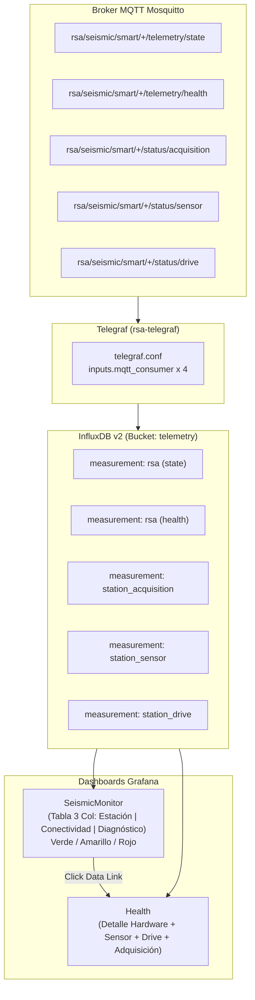

# Plan de Implementación: Modelo Jerárquico de Alertas y Visualización Centralizada en Grafana (SeismicMonitor y Health)

**Fecha**: 2026-09-10  
**Proyecto**: `RSA-Intern-TIG-MQTT` (Servidor Central)  
**Objetivo**: Implementar en el Stack TIG la ingesta de telemetría especializada de las estaciones acelerográficas (`station_acquisition`, `station_sensor`, `station_drive`), rediseñar el panel principal `SeismicMonitor` con una tabla minimalista de 3 columnas y diagnósticos en una sola palabra bajo un modelo jerárquico de colores (Verde / Amarillo / Rojo), y enriquecer el dashboard de detalle `Health` con paneles dedicados para auditar el estado del acelerómetro, la sincronización con Google Drive y la latencia del Ring Buffer.

---

## Prerrequisitos y Verificaciones

1. **Acceso al Workspace**: `montajes/server-ubuntu/rsa/RSA-Intern-TIG-MQTT`.
2. **Contenedores Operativos**: Stack Docker unificado en ejecución (`rsa-telegraf`, `rsa-influxdb`, `rsa-grafana`, `rsa-mosquitto`).
3. **Persistencia en InfluxDB**: Bucket `telemetry` operativo con retención configurada (90 días).
4. **Respaldo de Seguridad**: Generar copia de respaldo de `telegraf.conf`, `seismic_monitor.json` y `health.json` antes de aplicar modificaciones.

Comando de verificación previo:
```bash
cd /home/rsa/git/montajes/server-ubuntu/rsa/RSA-Intern-TIG-MQTT/services/docker-unified
docker compose ps
```

---

## Fase 1: Ingesta de Telemetría Especializada en Telegraf (`telegraf.conf`)

**Objetivo**: Suscribir Telegraf a los tópicos federados de adquisición, sensor y Google Drive, transformando los payloads JSON en measurements indexados en el bucket `telemetry` de InfluxDB v2.

### 1.1. Especificación de Measurements y Esquemas

| Measurement | Tópico Origen | Tags Indexados | Fields Numéricos / Cadenas |
|---|---|---|---|
| `station_acquisition` | `rsa/seismic/smart/+/status/acquisition` | `station_id`, `status`, `reason` | `age_seconds` (float), `threshold_seconds` (float), `last_frame_utc` (string), `timestamp` (string) |
| `station_sensor` | `rsa/seismic/smart/+/status/sensor` | `station_id`, `status`, `clock_source`, `reason` | `ax` (float), `ay` (float), `az` (float), `clock_error` (string), `timestamp` (string) |
| `station_drive` | `rsa/seismic/smart/+/status/drive` | `station_id`, `status`, `reason` | `pending_mseed` (int), `failed_uploads_protected` (int), `free_disk_percent` (float), `last_upload_utc` (string), `timestamp` (string) |

### 1.2. Acciones de Configuración en `services/docker-unified/telegraf.conf`

1. Añadir el bloque consumidor para **Adquisición (`station_acquisition`)**:
   ```toml
   # Ingesta de Salud de Adquisición (Ring Buffer Watchdog)
   [[inputs.mqtt_consumer]]
     servers = ["tcp://${MQTT_BROKER}:1883"]
     topics = ["rsa/seismic/smart/+/status/acquisition"]
     username = "${MQTT_USERNAME}"
     password = "${MQTT_PASSWORD}"
     qos = 1
     name_override = "station_acquisition"
     data_format = "json"
     tag_keys = ["station_id", "status", "reason"]
     json_string_fields = ["last_frame_utc", "timestamp"]

     [[inputs.mqtt_consumer.topic_parsing]]
       topic = "rsa/seismic/smart/+/status/acquisition"
       measurement = "_/_/_/_/_/_"
       tags = "_/_/_/station_id/_/_"
   ```

2. Añadir el bloque consumidor para **Integridad del Sensor (`station_sensor`)**:
   ```toml
   # Ingesta de Comprobación Triaxial e Integridad del Sensor
   [[inputs.mqtt_consumer]]
     servers = ["tcp://${MQTT_BROKER}:1883"]
     topics = ["rsa/seismic/smart/+/status/sensor"]
     username = "${MQTT_USERNAME}"
     password = "${MQTT_PASSWORD}"
     qos = 1
     name_override = "station_sensor"
     data_format = "json"
     tag_keys = ["station_id", "status", "clock_source", "reason"]
     json_string_fields = ["clock_error", "timestamp"]

     [[inputs.mqtt_consumer.topic_parsing]]
       topic = "rsa/seismic/smart/+/status/sensor"
       measurement = "_/_/_/_/_/_"
       tags = "_/_/_/station_id/_/_"
   ```

3. Añadir el bloque consumidor para **Sincronización Google Drive (`station_drive`)**:
   ```toml
   # Ingesta de Estado de Sincronización Google Drive
   [[inputs.mqtt_consumer]]
     servers = ["tcp://${MQTT_BROKER}:1883"]
     topics = ["rsa/seismic/smart/+/status/drive"]
     username = "${MQTT_USERNAME}"
     password = "${MQTT_PASSWORD}"
     qos = 1
     name_override = "station_drive"
     data_format = "json"
     tag_keys = ["station_id", "status", "reason"]
     json_string_fields = ["last_upload_utc", "timestamp"]

     [[inputs.mqtt_consumer.topic_parsing]]
       topic = "rsa/seismic/smart/+/status/drive"
       measurement = "_/_/_/_/_/_"
       tags = "_/_/_/station_id/_/_"
   ```

### 1.3. Comprobación (Checkpoint 1)

1. Reiniciar el contenedor de Telegraf:
   ```bash
   cd /home/rsa/git/montajes/server-ubuntu/rsa/RSA-Intern-TIG-MQTT/services/docker-unified
   docker compose restart telegraf
   docker logs --tail 30 rsa-telegraf
   ```
   *Criterio de Éxito*: Los logs muestran inicio limpio sin errores sintácticos de TOML o fallos de suscripción MQTT.

---

## Fase 2: Rediseño Minimalista de `SeismicMonitor` (`seismic_monitor.json`)

**Objetivo**: Implementar en Grafana la tabla de 3 columnas (`Estación`, `Conectividad`, `Diagnóstico Principal`) con diagnóstico en una sola palabra y coloreado de fila (`applyToRow: true`) siguiendo la jerarquía estricta: `Rojo > Amarillo > Verde`.

### 2.1. Lógica de Síntesis del Diagnóstico en Consulta Flux

La consulta Flux debe consultar los últimos registros de las 6 estaciones (`CHA1`, `CHA2`, `DEV0`, `FERR`, `TENG`, `TEST`) de los measurements:
1. `rsa` (`data_type == "state"`): Conectividad (`online` / `offline`).
2. `station_acquisition`: Estado de adquisición (`ok`, `warning`, `error`).
3. `station_sensor`: Estado del sensor triaxial (`ok`, `error`).
4. `station_drive`: Estado de subidas a Drive (`ok`, `warning`).
5. `rsa` (`data_type == "health"`): `disk_percent`, `cpu_temp_c`, `throttled`.

#### Consulta Flux Consolidada para el Panel de la Tabla:
```flux
// 1. Estado de Conectividad MQTT
conn = from(bucket: "telemetry")
  |> range(start: -7d)
  |> filter(fn: (r) => r._measurement == "rsa" and r.data_type == "state" and r._field == "status")
  |> group(columns: ["station_id"])
  |> last()
  |> map(fn: (r) => ({station_id: r.station_id, connectivity: r._value}))

// 2. Estado de Adquisición
acq = from(bucket: "telemetry")
  |> range(start: -7d)
  |> filter(fn: (r) => r._measurement == "station_acquisition" and r._field == "age_seconds")
  |> group(columns: ["station_id"])
  |> last()
  |> map(fn: (r) => ({station_id: r.station_id, acq_age: r._value, acq_status: r.status}))

// 3. Estado de Sensor
sensor = from(bucket: "telemetry")
  |> range(start: -7d)
  |> filter(fn: (r) => r._measurement == "station_sensor" and r._field == "az")
  |> group(columns: ["station_id"])
  |> last()
  |> map(fn: (r) => ({station_id: r.station_id, sensor_status: r.status}))

// 4. Estado de Drive
drive = from(bucket: "telemetry")
  |> range(start: -7d)
  |> filter(fn: (r) => r._measurement == "station_drive" and r._field == "pending_mseed")
  |> group(columns: ["station_id"])
  |> last()
  |> map(fn: (r) => ({station_id: r.station_id, drive_pending: r._value, drive_status: r.status}))

// 5. Estado de Disco y Hardware
hw = from(bucket: "telemetry")
  |> range(start: -7d)
  |> filter(fn: (r) => r._measurement == "rsa" and r.data_type == "health")
  |> filter(fn: (r) => r._field == "disk_percent" or r._field == "cpu_temp_c" or r._field == "throttled")
  |> group(columns: ["station_id"])
  |> pivot(rowKey: ["_time"], columnKey: ["_field"], valueColumn: "_value")
  |> last()
  |> map(fn: (r) => ({station_id: r.station_id, disk_p: r.disk_percent, temp_c: r.cpu_temp_c, throttled_val: r.throttled}))

// Unión y Evaluación Jerárquica del Diagnóstico Principal
join(tables: {c: conn, a: acq, s: sensor, d: drive, h: hw}, on: ["station_id"])
  |> map(fn: (r) => {
      diag = if r.connectivity == "offline" then "Offline"
             else if r.acq_status == "error" or r.acq_age > 300.0 then "Adquisicion"
             else if r.sensor_status == "error" then "Sensor"
             else if r.disk_p > 95.0 then "Disco"
             else if r.drive_status == "warning" or r.drive_pending > 3 then "Drive"
             else if r.disk_p > 85.0 then "Disco"
             else if r.temp_c > 70.0 or (exists r.throttled_val and r.throttled_val != "0x0") then "Hardware"
             else "OK"
      return {
        "Estación": r.station_id,
        "Conectividad": r.connectivity,
        "Diagnóstico Principal": diag
      }
  })
  |> keep(columns: ["Estación", "Conectividad", "Diagnóstico Principal"])
```

### 2.2. Configuración de Overrides y Formato de Celda en `seismic_monitor.json`

1. **Columnas**: Organizar en el orden:
   - Posición 0: `Estación`
   - Posición 1: `Conectividad`
   - Posición 2: `Diagnóstico Principal`
2. **Mapeo de Colores para "Diagnóstico Principal"**:
   - `OK` $\rightarrow$ `green` (Verde)
   - `Drive` $\rightarrow$ `dark-orange` / `yellow` (Amarillo)
   - `Hardware` $\rightarrow$ `dark-orange` / `yellow` (Amarillo)
   - `Disco` $\rightarrow$ Si $disk > 95\%$ Rojo; si $disk > 85\%$ Amarillo.
   - `Offline` $\rightarrow$ `dark-red` (Rojo)
   - `Adquisicion` $\rightarrow$ `dark-red` (Rojo)
   - `Sensor` $\rightarrow$ `dark-red` (Rojo)
3. **Aplicación a Fila Completa**: `custom.cellOptions.applyToRow = true` con `type = "color-background"` y `mode = "gradient"`.
4. **Data Link**:
   - URL: `/d/ffcrjb8bumy2ob2/health?from=now-2d&to=now&refresh=5s&var-station=${__data.fields["Estación"]}`.
5. **Incremento de Versión**: Incrementar `version` a `3` en `seismic_monitor.json`.

### 2.3. Comprobación (Checkpoint 2)

1. Reiniciar Grafana para aplicar el dashboard aprovisionado:
   ```bash
   docker compose restart grafana
   ```
2. Inspeccionar `SeismicMonitor` en el navegador (`http://<ip-servidor>:3000/d/ffcrjb8bumy2ob/seismicmonitor`):
   - Se observan las 3 columnas limpias.
   - Diagnósticos muestran exclusivamente palabras clave (`OK`, `Offline`, `Adquisicion`, `Sensor`, `Drive`).
   - Clic en una fila abre `Health` filtrado por la estación elegida.

---

## Fase 3: Enriquecimiento del Dashboard de Detalle `Health` (`health.json`)

**Objetivo**: Añadir filas colapsables y paneles específicos en `health.json` para que el operador audite las métricas detalladas cuando una estación esté en estado de advertencia o error.

### 3.1. Nuevos Paneles a Incorporar

#### Fila 1: "Integridad del Sensor Acelerométrico"
1. **Tabla Triaxial y Reloj (`type: "table"`)**:
   - Consulta:
     ```flux
     from(bucket: "telemetry")
       |> range(start: v.timeRangeStart, stop: v.timeRangeStop)
       |> filter(fn: (r) => r._measurement == "station_sensor" and r.station_id == "${station}")
       |> pivot(rowKey: ["_time"], columnKey: ["_field"], valueColumn: "_value")
       |> keep(columns: ["_time", "ax", "ay", "az", "clock_source", "clock_error", "reason"])
       |> sort(columns: ["_time"], desc: true)
       |> limit(n: 10)
     ```
   - Columnas visibles: `Timestamp`, `Aceleración X (m/s²)`, `Aceleración Y (m/s²)`, `Aceleración Z (m/s²)`, `Fuente Reloj`, `Error Detectado`.
2. **Stat Panel de Calibración (`type: "stat"`)**:
   - Muestra `CALIBRACIÓN FÍSICA`: `NOMINAL` (Verde) si $|Z - 9.81| \le 0.8$ o `ANOMALÍA` (Rojo) si excede.

#### Fila 2: "Sincronización con Google Drive"
1. **Stat Panel de Archivos Pendientes (`type: "stat"`)**:
   - Muestra el valor de `pending_mseed` más reciente.
   - Thresholds: Verde (0), Amarillo (1 a 5), Rojo (> 5).
2. **Stat Panel de Archivos Protegidos por Fallo (`type: "stat"`)**:
   - Muestra el valor de `failed_uploads_protected`.
   - Thresholds: Verde (0), Amarillo (1 a 2), Rojo (> 2).
3. **Tabla de Historial de Subidas (`type: "table"`)**:
   - Muestra `last_upload_utc`, `free_disk_percent`, `reason`.

#### Fila 3: "Salud del Pipeline de Adquisición (Ring Buffer)"
1. **Time Series de Latencia (`type: "timeseries"`)**:
   - Consulta sobre `station_acquisition` del field `age_seconds`.
   - Threshold visual fijo en `300 s` (Línea roja discontinua).
2. **Stat Semáforo Ring Buffer (`type: "stat"`)**:
   - Muestra `OK`, `STALE_DATA` o `NO_DATA`.
   - Mapeo de colores: `ok` (Verde), `stale_data` (Rojo), `no_data_available` (Rojo).

### 3.2. Acciones en `services/grafana/provisioning/dashboards/health.json`

1. Insertar las definiciones JSON de los nuevos paneles respetando la cuadrícula `gridPos` (ajustando `y` para acomodar las nuevas filas sin superponerse con CPU, Disco y Memoria).
2. Incrementar el campo `version` a `4`.

### 3.3. Comprobación (Checkpoint 3)

1. Reiniciar Grafana:
   ```bash
   docker compose restart grafana
   ```
2. Acceder a `Health` para la estación `DEV0`:
   - Verificar la presencia de las secciones de Sensor, Google Drive y Adquisición.
   - Comprobar que los paneles responden dinámicamente a la variable `${station}`.

---

## Fase 4: Pruebas de Integración y Validación con Datos Sintéticos

**Objetivo**: Validar el comportamiento de las alertas enviando mensajes MQTT de prueba desde el servidor central mediante `mosquitto_pub` y auditando el resultado en Grafana.

### 4.1. Escenarios de Prueba a Ejecutar

#### Escenario 1: Prueba de Estado Nominal
```bash
docker exec -it rsa-mosquitto mosquitto_pub -h localhost -p 1883 \
  -t "rsa/seismic/smart/TEST/status/acquisition" \
  -m '{"status":"ok","age_seconds":1.2,"threshold_seconds":300,"last_frame_utc":"2026-09-10T16:00:00Z","station_id":"TEST","timestamp":"2026-09-10T16:00:01Z"}' -q 1 -r

docker exec -it rsa-mosquitto mosquitto_pub -h localhost -p 1883 \
  -t "rsa/seismic/smart/TEST/status/sensor" \
  -m '{"status":"ok","ax":0.002,"ay":-0.001,"az":9.805,"clock_source":"GPS","clock_error":null,"reason":"nominal","station_id":"TEST","timestamp":"2026-09-10T16:00:02Z"}' -q 1 -r

docker exec -it rsa-mosquitto mosquitto_pub -h localhost -p 1883 \
  -t "rsa/seismic/smart/TEST/status/drive" \
  -m '{"status":"ok","pending_mseed":0,"failed_uploads_protected":0,"free_disk_percent":52.1,"reason":"all_synced","station_id":"TEST","timestamp":"2026-09-10T16:00:03Z"}' -q 1 -r
```
*Resultado Esperado*: En `SeismicMonitor`, la fila de `TEST` se muestra en **Verde** con diagnóstico `OK`.

#### Escenario 2: Prueba de Alerta Amarilla (Falla de Google Drive)
```bash
docker exec -it rsa-mosquitto mosquitto_pub -h localhost -p 1883 \
  -t "rsa/seismic/smart/TEST/status/drive" \
  -m '{"status":"warning","pending_mseed":4,"failed_uploads_protected":2,"free_disk_percent":52.1,"reason":"upload_retry_retained","station_id":"TEST","timestamp":"2026-09-10T16:05:00Z"}' -q 1 -r
```
*Resultado Esperado*: En `SeismicMonitor`, la fila de `TEST` cambia automáticamente a **Amarillo** con diagnóstico `Drive`.

#### Escenario 3: Prueba de Alerta Roja (Incoherencia del Sensor)
```bash
docker exec -it rsa-mosquitto mosquitto_pub -h localhost -p 1883 \
  -t "rsa/seismic/smart/TEST/status/sensor" \
  -m '{"status":"error","ax":-0.85,"ay":2.14,"az":0.10,"clock_source":"GPS","clock_error":"accelerometer_anomaly","reason":"accelerometer_anomaly","station_id":"TEST","timestamp":"2026-09-10T16:10:00Z"}' -q 1 -r
```
*Resultado Esperado*: En `SeismicMonitor`, la fila de `TEST` cambia inmediatamente a **Rojo** con diagnóstico `Sensor`.

#### Escenario 4: Prueba de Alerta Roja (Adquisición Estancada)
```bash
docker exec -it rsa-mosquitto mosquitto_pub -h localhost -p 1883 \
  -t "rsa/seismic/smart/TEST/status/acquisition" \
  -m '{"status":"error","age_seconds":420.5,"threshold_seconds":300,"last_frame_utc":"2026-09-10T16:00:00Z","reason":"stale_data","station_id":"TEST","timestamp":"2026-09-10T16:10:00Z"}' -q 1 -r
```
*Resultado Esperado*: En `SeismicMonitor`, la fila de `TEST` permanece en **Rojo** mostrando diagnóstico `Adquisicion` (máxima severidad sobre Drive).

---

## Diagrama de Flujo de Datos en el Servidor TIG


