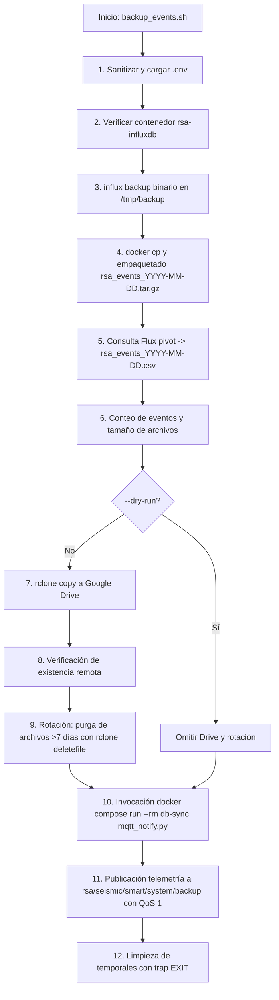

# Protocolo de Respaldo Diario InfluxDB (`backup_events.sh`) — Contexto para Agentes IA

> Script Bash robusto y automatizado para la extracción de snapshots binarios nativos de InfluxDB v2 (`rsa_events`), exportación tabular a CSV con Flux `pivot()`, sincronización en la nube vía Google Drive (`rclone`), rotación automática de 7 días y publicación de telemetría a MQTT con QoS 1.

**Ruta**: `scripts/db_sync/backup_events.sh`  
**Rutas de Archivos Asociados**:
- Notificador MQTT: `scripts/db_sync/mqtt_notify.py`
- Contenedor Utilidades: `scripts/db_sync/Dockerfile`
- Script de Restauración: `scripts/db_sync/restore_events.sh`
- Gestor Systemd: `services/systemd/manage_backup_timer.sh`
- Variables de Entorno: `services/docker-unified/.env`

**LOC**: `backup_events.sh`: 195  
**Lenguaje/Formato**: Bash (`set -euo pipefail`), Docker CLI, Influx CLI, rclone, Flux Query  
**Dependencias/Binarios**: `docker`, `rclone`, `tar`, `stat`, `date`, `sed`, `awk`  
**Proceso**: Ejecutado como tarea batch oneshot en el host (manualmente o programado diariamente a las 02:00 UTC vía systemd timer).

---

## 🎯 Arquitectura y Flujo de Ejecución

---

## ⚙️ Variables de Entorno y Argumentos CLI

### Variables de Entorno (`.env`)

| Variable | Descripción | Default |
|---|---|---|
| `INFLUXDB_TOKEN` | Token de autenticación admin de InfluxDB v2 | Auto-detectado del contenedor |
| `INFLUXDB_ORG` | Organización en InfluxDB | `rsa` |
| `INFLUXDB_EVENTS_BUCKET` | Bucket de catálogo de eventos | `rsa_events` |
| `TELEGRAF_CLIENT_ID` | Identificador dinámico del servidor emisor | `events-server` |
| `RCLONE_REMOTE` | Destino remoto en Google Drive | `gdrive:DIA/Datos Estaciones/RSA-Backups/influxdb` |

### Opciones CLI

| Opción | Descripción |
|---|---|
| `--dry-run` | Ejecuta snapshot y CSV sin subir a Drive ni purgar |
| `--retention-days N` | Días de retención para purga en Google Drive (default: 7) |
| `--env-file PATH` | Ruta personalizada al archivo `.env` |

---

## 🛠️ Componentes y Mecanismos Clave

| Componente | Mecanismo |
|---|---|
| **Sanitización `.env`** | Limpieza de espacios, retornos de carro `\r` y comillas para evitar fallos de encabezado HTTP en `influx CLI`. |
| **Snapshot Binario** | `docker exec rsa-influxdb influx backup /tmp/backup --bucket rsa_events` para recuperación destructiva exacta. |
| **Exportación CSV Tabular** | Consulta Flux con `pivot(rowKey: ["_time","event_id"], columnKey: ["_field"], valueColumn: "_value")` para inspección humana y analítica tabular. |
| **Resiliencia de Limpieza** | `trap cleanup EXIT` garantiza que `/tmp/rsa_backup_*` y `/tmp/backup` en el contenedor se borren incluso si el script falla. |
| **Notificación Desacoplada** | Si ocurre un fallo, dispara `mqtt_notify.py --status failure` reportando el error a los dashboards de monitoreo. |

---

## ⚠️ Limitaciones Conocidas

- **Alcance Exclusivo**: Solo respalda `rsa_events`. No respalda el bucket `telemetry` (datos de 90 días regenerables).
- **Acceso a Google Drive**: Requiere que el remote `rclone` (`gdrive:`) esté preconfigurado y autenticado en el host.
