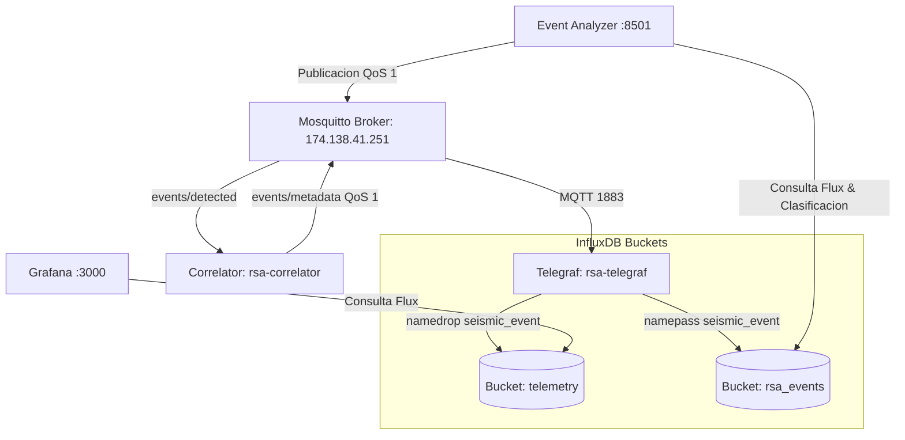

# Docker Compose Unificado (TIG Stack + MQTT + Correlador + Event Analyzer) — Contexto para Agentes IA

> Orquestación de servicios en un stack Docker unificado (InfluxDB, Telegraf, Grafana, Correlador Regional y Event Analyzer) para la recolección, almacenamiento de telemetría y metadatos de eventos sísmicos, análisis en tiempo real y visualización web interactiva.

**Ruta**: `services/docker-unified/docker-compose.yml`  
**Rutas de Archivos Asociados**:
- Telegraf Config: `services/docker-unified/telegraf.conf`
- Correlador Regional: `scripts/correlator/`
- Visualizador Web: `services/event-analyzer/`
- Grafana Provisioning: `services/grafana/provisioning/dashboards/` | `datasources/`

**LOC**: `docker-compose.yml`: 178 | `telegraf.conf`: 150  
**Lenguaje/Formato**: YAML (Docker Compose / Provisioning), TOML (Telegraf), JSON (Grafana Dashboards)  
**Dependencias/Imágenes**: `influxdb:2.7`, `telegraf:1.28`, `grafana/grafana:11.2.0`, Python 3.11  
**Proceso**: Stack unificado en contenedores Docker orquestado mediante Docker Compose en la red externa `rsa_network`.

---

## 🎯 Arquitectura del Stack Unificado

El stack coordina 5 servicios integrados:

1. **InfluxDB (`rsa-influxdb`)**:
   - Gestiona dos buckets: `telemetry` (telemetría y salud de acelerógrafos con retención de 90 días) y `rsa_events` (metadatos e índice temporal de eventos sísmicos con retención infinita).
2. **Telegraf (`rsa-telegraf`)**:
   - **Consumidor Telemetría**: Ingesta métricas de salud y estado en el bucket `telemetry` con `namedrop = ["seismic_event"]`.
   - **Consumidor Eventos Sísmicos**: Suscripción persistente con QoS 1 en `rsa/seismic/smart/events/metadata`. Parsea mediante `json_v2` con `timestamp_path = "timestamp_utc"` y escribe exclusivamente en el bucket `rsa_events` con `namepass = ["seismic_event"]`.
3. **Grafana (`rsa-grafana`)**:
   - Visualización de telemetría y salud mediante dashboards auto-provisionados (`seismic_monitor.json` y `health.json`).
4. **Correlador Regional (`rsa-correlator`)**:
   - Valida coincidencias multie-stación en tiempo real y publica tanto la orden de extracción broadcast como los metadatos JSON a Telegraf.
5. **Event Analyzer (`rsa-event-analyzer`)**:
   - Aplicación web en Streamlit (:8501) y Dash (:8050) para visualización multi-estación de trazas MiniSEED y ciclo de clasificación.

---

## ⚙️ Variables de Entorno Clave (`.env`)

- `DATA_DIR=/home/rsa/data`: Ruta base para persistencia de InfluxDB, Grafana y Node-RED.
- `DRIVE_DIR=/home/rsa/datos_estaciones_drive`: Punto de montaje para trazas MiniSEED.
- `INFLUXDB_BUCKET=telemetry`: Bucket de series temporales de salud y estado.
- `INFLUXDB_EVENTS_BUCKET=rsa_events`: Bucket de metadatos de eventos sísmicos.
- `TELEGRAF_CLIENT_ID=telegraf-events-oficina`: ID de sesión persistente para Telegraf.
- `MQTT_BROKER`, `MQTT_USERNAME`, `MQTT_PASSWORD`: Configuración del broker central.

---

## 🐳 Servicios Definidos en `docker-compose.yml`

| Servicio | Contenedor | Puerto | Dependencias | Propósito |
|----------|------------|--------|--------------|-----------|
| `influxdb` | `rsa-influxdb` | 8086 | - | Base de datos de telemetría y eventos. |
| `telegraf` | `rsa-telegraf` | - | `influxdb` (healthy) | Ingesta dual segmentada (telemetría $\rightarrow$ telemetry, eventos $\rightarrow$ rsa_events). |
| `grafana` | `rsa-grafana` | 3000 | `influxdb` | Dashboards de salud de estaciones. |
| `correlator` | `rsa-correlator` | - | - | Validación regional y disparo broadcast. |
| `event-analyzer` | `rsa-event-analyzer` | 8501, 8050 | - | Visualizador web y clasificador interactivo. |
