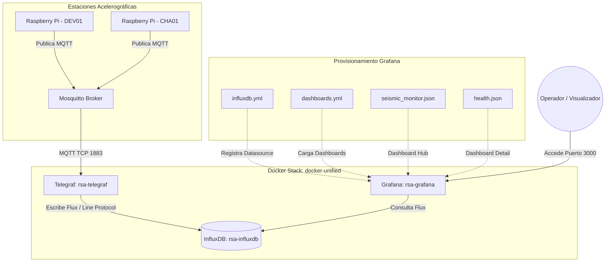

# Docker Compose Unificado (TIG Stack + MQTT) — Contexto para Agentes IA

> Orquestación de servicios en un stack Docker unificado (InfluxDB, Telegraf y Grafana) para la recolección, almacenamiento y visualización de telemetría de acelerógrafos mediante MQTT.

**Ruta**: `services/docker-unified/docker-compose.yml`
**Rutas de Archivos Asociados**:
- Telegraf Config: `services/docker-unified/telegraf.conf`
- Grafana Provisioning: `services/grafana/provisioning/dashboards/dashboards.yml` | `datasources/influxdb.yml`
- Grafana Dashboards: `services/grafana/provisioning/dashboards/seismic_monitor.json` | `health.json`

**LOC**: `docker-compose.yml`: 126 | `telegraf.conf`: 14,263 | `influxdb.yml`: 16 | `dashboards.yml`: 14 | `seismic_monitor.json`: 166 | `health.json`: 930
**Lenguaje/Formato**: YAML (Docker Compose / Provisioning), TOML (Telegraf), JSON (Grafana Dashboards)
**Dependencias/Imágenes**: `influxdb:2.7`, `telegraf:1.28`, `grafana/grafana:11.2.0`
**Proceso**: Stack unificado en contenedores Docker gestionado por Docker Compose, comunicado por la red externa `rsa_network`.

---

## Arquitectura / Estructura de Servicios

El flujo de datos del stack unificado se origina en las estaciones acelerográficas distribuidas, las cuales adquieren telemetría sísmica y de salud, y la publican en un broker MQTT. El stack TIG consume y visualiza esta información:

1. **Recolección (Telegraf)**: El contenedor `rsa-telegraf` se suscribe al broker MQTT y lee los tópicos en formato JSON. Mediante `topic_parsing`, extrae `station_id` y `data_type` como tags indexados en InfluxDB.
2. **Almacenamiento (InfluxDB)**: Las métricas parseadas se guardan en la base de datos de series temporales `rsa-influxdb` en el bucket `telemetry`.
3. **Visualización (Grafana)**: El contenedor `rsa-grafana` consume las métricas desde InfluxDB ejecutando consultas Flux y las presenta en dos dashboards auto-provisionados.

---

## Configuraciones / Variables de Entorno

### Variables de Entorno Requeridas (`.env`)
- `INFLUXDB_ADMIN_USER` & `INFLUXDB_ADMIN_PASSWORD`: Credenciales del usuario administrador para la configuración inicial de InfluxDB.
- `INFLUXDB_ORG`: Organización de InfluxDB (ej. `rsa`).
- `INFLUXDB_BUCKET`: Nombre del bucket de almacenamiento (ej. `telemetry`).
- `INFLUXDB_RETENTION`: Período de retención de los datos (ej. `90d`).
- `INFLUXDB_TOKEN`: Token de autenticación permanente utilizado por Telegraf para escribir y por Grafana para leer.
- `MQTT_BROKER`: Host del broker MQTT (servidor VPS).
- `MQTT_USERNAME` & `MQTT_PASSWORD`: Credenciales de acceso para el broker MQTT.
- `GRAFANA_ADMIN_USER` & `GRAFANA_ADMIN_PASSWORD`: Credenciales del administrador de la interfaz web de Grafana (por defecto `admin`).

### Puertos Expuestos
- `8086:8086` (InfluxDB): Acceso al panel web y API de InfluxDB.
- `3000:3000` (Grafana): Interfaz web de monitoreo de Grafana.

### Volúmenes de Persistencia e Integración
- **InfluxDB**:
  - `/home/rsa/data/influxdb/data:/var/lib/influxdb2` (Datos persistentes de la base de datos)
  - `/home/rsa/data/influxdb/config:/etc/influxdb2` (Configuraciones persistentes)
- **Telegraf**:
  - `./telegraf.conf:/etc/telegraf/telegraf.conf:ro` (Montaje en solo lectura de la configuración activa)
- **Grafana**:
  - `/home/rsa/data/grafana:/var/lib/grafana` (Datos del sistema Grafana)
  - `../grafana/provisioning:/etc/grafana/provisioning:ro` (Aprovisionamiento automático de dashboards y fuentes de datos en solo lectura)

### Configuración de Red
Los contenedores comparten la red `monitoring` conectada a una red externa del motor de Docker llamada `rsa_network` (`external: true`), garantizando la interoperabilidad con contenedores como Node-RED.

---

## Componentes / Servicios Clave

### Servicios de Contenedores (`docker-compose.yml`)

| Elemento / Servicio | Imagen Docker | Propósito y Configuración |
|---------------------|---------------|---------------------------|
| `influxdb` | `influxdb:2.7` | Base de datos de series temporales. Configura automáticamente el bucket, org y token usando variables de entorno en el primer arranque. Implementa un healthcheck con `influx ping`. |
| `telegraf` | `telegraf:1.28` | Agente recolector de telemetría. Espera a que `influxdb` esté en estado saludable (`service_healthy`) antes de iniciar. No expone puertos. |
| `grafana` | `grafana/grafana:11.2.0` | Plataforma de visualización. Implementa healthcheck mediante `/api/health`. Su zona horaria por defecto está configurada para `America/Guayaquil`. |

### Configuración de Ingesta (`telegraf.conf`)

| Elemento de Configuración | Tipo | Descripción / Detalle |
|---------------------------|------|-----------------------|
| `[[outputs.influxdb_v2]]` | Plugin de Salida | Envía métricas a `http://influxdb:8086` usando `${INFLUXDB_TOKEN}`, `${INFLUXDB_ORG}` y `${INFLUXDB_BUCKET}`. |
| `[[inputs.mqtt_consumer]]` | Plugin de Entrada | Se suscribe a `telemetry/+/data` y `rsa/seismic/smart/+/telemetry/state`, `/health`, `/heartbeat` y `rsa/seismic/smart/+/events/detected`, `/data`. |
| `json_string_fields` | Opción MQTT | Mantiene los campos `status`, `last_event` y `throttled` como cadenas de texto en InfluxDB en lugar de descartarlos. |
| `[[inputs.mqtt_consumer.topic_parsing]]` | Procesador de Tópicos | Parsea la jerarquía de tópicos en tags. Para tópicos `rsa/seismic/smart/{station_id}/telemetry/{data_type}`, extrae `station_id` (nivel 4) y `data_type` (nivel 6) como dimensiones de búsqueda. |

### Provisionamiento de Visualización (`services/grafana/`)

| Archivo / Recurso | Formato | Descripción / Detalle |
|-------------------|---------|-----------------------|
| `datasources/influxdb.yml` | YAML | Registra el datasource `InfluxDB` mediante lenguaje Flux. Conecta con el contenedor a través de la URL de red `http://influxdb:8086`. |
| `dashboards/dashboards.yml` | YAML | Registra el proveedor de dashboards apuntando a `/etc/grafana/provisioning/dashboards` para cargarlos en la carpeta `RSA - Seismic`. |
| `dashboards/seismic_monitor.json` | JSON | **Dashboard Hub (SeismicMonitor)**. Muestra una vista unificada tipo tabla con el estado actual (`online`/`offline`) de todas las estaciones en las últimas 168 horas (7 días). Posee un enlace dinámico en cada fila para navegar al dashboard de detalle de salud. |
| `dashboards/health.json` | JSON | **Dashboard de Salud de Estación**. Proporciona visualización detallada basada en una variable dinámica (`${station}`). Contiene paneles tipo gauge y series de tiempo para: tiempo encendido, histórico de estado, uso de disco, RAM, carga de CPU (15 min), temperatura y throttling. |

---

## Limitaciones Conocidas / TODOs

- **Red Externa Obligatoria**: Si la red externa Docker `rsa_network` no está creada de antemano (`docker network create rsa_network`), el comando `docker compose up` fallará.
- **Protocolo MQTT Inseguro**: Las conexiones al broker MQTT usan `tcp://` en el puerto 1883 sin cifrado de transporte. Se recomienda migrar a MQTTS (`ssl://` puerto 8883) en entornos expuestos.
- **Redirecciones de Enlace Cableadas**: El dashboard `health.json` posee un enlace de retorno ("Volver") con una dirección IP fija cableada (`http://10.22.147.102:3000`). Si la dirección IP o el puerto del VPS cambian, este enlace fallará. Deberían utilizarse rutas relativas (ej. `/d/ffcrjb8bumy2ob/seismicmonitor`).
- **Dependencia de Rutas en Host**: Los volúmenes montados asumen que `/home/rsa/data/` está disponible y cuenta con los permisos de escritura adecuados para los usuarios internos de los contenedores Docker (especialmente InfluxDB y Grafana).
