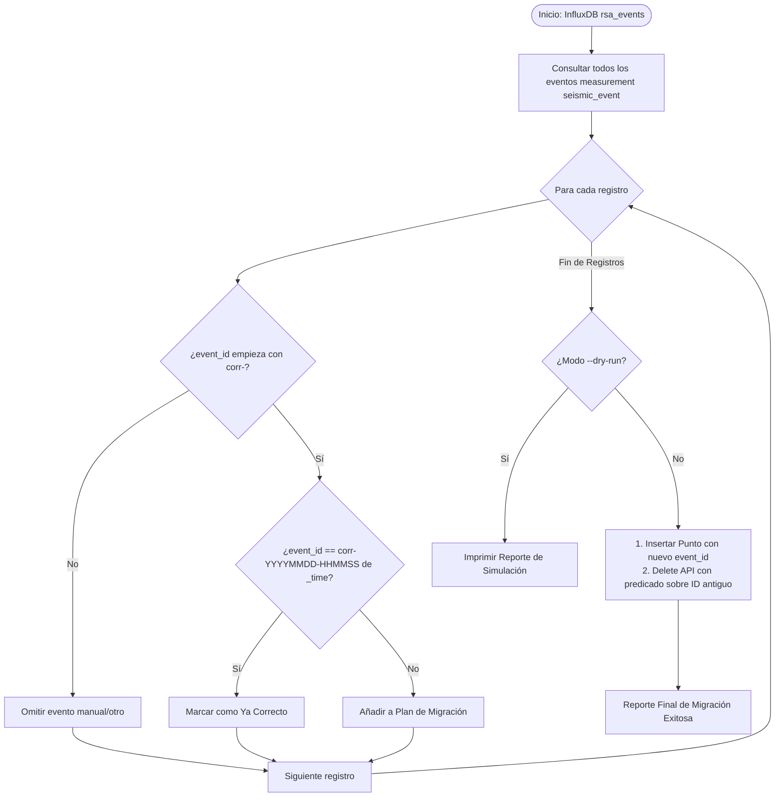

# Migración Retroactiva de Event IDs en InfluxDB (`fix_event_ids.py`) — Contexto para Agentes IA

> Script de mantenimiento y sincronización temporal para InfluxDB v2 que audita, recalcula y migra retroactivamente los identificadores de eventos (`event_id`) generados por el correlador regional con desfase temporal, alineándolos unívocamente con el timestamp físico `_time` y los archivos MiniSEED en disco.

**Ruta**: `scripts/db_sync/fix_event_ids.py`  
**Rutas de Archivos Asociados**:
- Integración Docker Compose: `services/docker-unified/docker-compose.yml`
- Variables de Entorno: `services/docker-unified/.env` o `scripts/correlator/.env`
- ADR de Referencia: `docs/adr/016_resolucion_global_trazas_y_determinacion_temporal_event_id.md`

**LOC**: 205 | **Lenguaje**: Python 3.11 | **Dependencias**: `influxdb-client>=1.36.0`, `python-dotenv>=1.0.0`  
**Proceso**: Script de ejecución puntual (manual o vía `docker exec -i rsa-event-analyzer python3 - < scripts/db_sync/fix_event_ids.py`).

---

## 🎯 Propósito y Contexto Operativo

Previo al **ADR-016**, el Correlador Regional generaba `event_id` como `corr-YYYYMMDD-HHMMSS` usando la hora del reloj del sistema al momento de procesamiento (`datetime.now()`), mientras que `_time` y los recortes en disco se basaban en la detección física más temprana (`dt_min`). Esto generaba desfases de 3 a 12 segundos.

`fix_event_ids.py` resuelve este problema en eventos históricos:
1. **Audita**: Examina todos los registros con `event_id` prefijado por `corr-` en el bucket `rsa_events`.
2. **Compara**: Evalúa si el sufijo temporal del `event_id` coincide exactamente con `_time`.
3. **Migra de Forma Segura**:
   - Inserta el nuevo registro con `event_id` corregido (`corr-{_time.strftime('%Y%m%d-%H%M%S')}`), preservando todos los campos (`stations`, `n_stations`, `duration_s`, `details`, etc.).
   - Elimina el registro antiguo mediante la Delete API de InfluxDB con predicado en la ventana temporal puntual ($\pm 1$ s).
4. **Protege Clasificaciones**: Omite eventos manuales o no provenientes del correlador.

---

## 🏗️ Flujo de Migración

---

## ⚙️ Configuraciones y Argumentos CLI

| Argumento | Variable de Entorno | Valor por Defecto | Descripción |
|-----------|----------------------|-------------------|-------------|
| `--url` | `INFLUXDB_URL` | `http://localhost:8086` | Endpoint HTTP de InfluxDB v2 |
| `--token` | `INFLUXDB_TOKEN` | `""` | Token de acceso con permisos de lectura/escritura |
| `--org` | `INFLUXDB_ORG` | `rsa` | Organización en InfluxDB |
| `--bucket` | `INFLUXDB_EVENTS_BUCKET` | `rsa_events` | Bucket que almacena el catálogo de eventos |
| `--dry-run` | — | `False` | Ejecuta la auditoría completa sin alterar la base de datos |

---

## 🛠️ Componentes y Funciones Clave

| Función | Descripción |
|---------|-------------|
| `load_environment()` | Carga variables de entorno buscando archivos `.env` en directorios relativos estándar. |
| `parse_args()` | Procesa argumentos de línea de comandos (`--dry-run`, `--url`, `--token`, etc.). |
| `migrate_event_ids()` | Ejecuta el flujo principal: consulta Flux, evaluación de coherencia temporal, inserción y borrado transaccional. |

---

## 📌 Limitaciones Conocidas y Buenas Prácticas

1. **Backup Previo**: Siempre debe realizarse un respaldo de InfluxDB (`influx backup`) antes de ejecutar en modo de producción.
2. **Ejecución dentro de Docker**: Al ejecutarse en servidores donde el host no tiene `influxdb-client` instalado, se recomienda ejecutar vía `docker exec -i rsa-event-analyzer python3 - < scripts/db_sync/fix_event_ids.py`.
