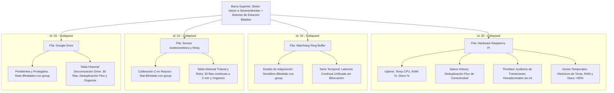

# health.json — Contexto para Agentes IA

> Dashboard detallado de salud y telemetría por estación en Grafana (v13), estructurado en cuatro filas colapsables por defecto (Hardware/Sistema, Watchdog de Adquisición, Integridad del Sensor/Reloj y Sincronización con Google Drive) con deduplicación selectiva de transiciones en Flux, muestreo continuo de 30 filas en sensor y ordenamiento homogéneo de columnas con Estado al final.

**Ruta**: `services/grafana/provisioning/dashboards/health.json`  
**LOC**: 1747 | **Lenguaje/Formato**: JSON (Grafana Dashboard Model v39, dashboard version 13) | **Dependencias**: Grafana 11.2.0, InfluxDB v2 Datasource (`uid: P951FEA4DE68E13C5`), Variable de plantilla `$station`, Dashboard SeismicMonitor (`uid: ffcrjb8bumy2ob`)  
**Proceso**: Provisionado automáticamente en el arranque de Grafana vía `services/grafana/provisioning/dashboards/dashboards.yaml`.

---

## 🎯 Arquitectura y Organización en Filas Colapsables

Para evitar la saturación de información durante la supervisión de 6 estaciones, `health.json` encapsula sus paneles dentro de **4 filas colapsables principales** (`"type": "row"`, con `"collapsed": true` por defecto). Todos los paneles hijos residen en el arreglo `row.panels` de cada fila correspondiente, ejecutando consultas Flux en InfluxDB únicamente cuando el operador expande la sección de interés.



---

## ⚙️ Configuraciones y Parámetros del Dashboard

| Parámetro | Valor | Descripción |
|-----------|-------|-------------|
| `uid` | `ffcrjb8bumy2ob2` | Identificador único del dashboard en Grafana. |
| `title` | `Health` | Título del dashboard. |
| `version` | `13` | Versión incremental del dashboard para aprovisionamiento. |
| `refresh` | `5s` | Refresco automático de paneles activos. |
| `time.from` / `time.to` | `now-2d` a `now` | Rango temporal predeterminado (2 días). |
| Variable `$station` | Consulta Flux dinámica sobre `station_id` en `telemetry` | Permite alternar entre `CHA1`, `CHA2`, `DEV0`, `FERR`, `TENG`, `TEST`. |
| Datasource UID | `P951FEA4DE68E13C5` | Conexión InfluxDB v2 provisionada. |

---

## 🧩 Filas y Paneles Principales

### 1. Salud del Sistema y Hardware (Raspberry Pi) — `Row ID: 30`
- **Tiempo Encendido (`id: 4`)**: Actividad continua en segundos/días.
- **Status History (`id: 9`)**: Tabla histórica con deduplicación matemática de latidos en Flux (`map` de estados a enteros + `difference(columns: ["state_code"], keepFirst: true)` + filtro `!= 0`), conservando la línea base inicial y registrando solo transiciones de conectividad.
- **Métricas Instantáneas (`id: 2, 5, 3`)**: Tarjetas Stat de Disco (%), RAM (%) y Carga CPU.
- **Throttled (`id: 6`)**: Tabla de auditoría de subvoltaje y estrangulamiento térmico de la Raspberry Pi; mapea máscaras hexadecimales (`0x0`, `0x50000`, `0xd0000`, etc.) a identificadores numéricos discretos y detecta transiciones con `difference()`, evitando errores de sintaxis en `int()` y eliminando el ruido constante de `0x0`.
- **Históricos (`id: 11, 13, 12, 1`)**: Series temporales de evolución de almacenamiento (>90%), memoria, carga de CPU y temperatura térmica.

### 2. Salud de Adquisición (Ring Buffer Watchdog) — `Row ID: 20`
- **Estado Ring Buffer (`id: 21`)**: Panel Stat verde/rojo derivado de `station_acquisition.status`, blindado contra bifurcación de tarjetas mediante `group(columns: ["_measurement", "_field", "station_id"])` y `sort(columns: ["_time"])` antes de `last()`.
- **Latencia de Adquisición Ring Buffer (`id: 22`)**: Gráfica de serie temporal continua con umbral crítico en 300 segundos; unificada con `group(columns: ["_measurement", "_field", "station_id"])` para impedir que etiquetas de anomalía (`status="warning"`, `reason="stale_data"`) dividan la gráfica en series divergentes.

### 3. Integridad del Sensor Acelerométrico y Reloj — `Row ID: 23`
- **Calibración Triaxial (Z) (`id: 24`)**: Panel Stat blindado con `group()` previo a `last()` para evitar duplicidad de tarjetas, calibrado en $9.81 \pm 0.8 \text{ m/s}^2$ para detectar volcamiento o saturación.
- **Historial de Integridad Triaxial y Reloj (`id: 25`)**: Tabla histórica ampliada a **30 filas** con muestreo periódico continuo cada 5 minutos de las aceleraciones triaxiales ($A_x, A_y, A_z$), fuente de reloj y diagnóstico. Utiliza la transformación `organize` de Grafana para asegurar que las columnas numéricas se presenten primero y las de estado al final:
  $$\text{Fecha} \rightarrow \text{Acc X (m/s²)} \rightarrow \text{Acc Y (m/s²)} \rightarrow \text{Acc Z (m/s²)} \rightarrow \text{Fuente Reloj} \rightarrow \mathbf{Estado} \rightarrow \text{Diagnóstico / Motivo}$$

### 4. Sincronización con Google Drive — `Row ID: 26`
- **Pendientes de Subida (`id: 27`) y Protegidos por Fallo (`id: 28`)**: Paneles Stat blindados con `group()` y `sort()` previos a `last()`.
- **Historial de Sincronización Google Drive (`id: 29`)**: Tabla histórica ampliada a **30 filas**. Integra deduplicación Flux de transiciones combinando estado, motivo, conteo de pendientes y protegidos en un `state_code` ponderado. Incorpora la transformación `organize` para alinear las columnas con la de Estado y Motivo al final:
  $$\text{Fecha} \rightarrow \text{Pendientes} \rightarrow \text{Protegidos} \rightarrow \text{Disco Libre (\%)} \rightarrow \mathbf{Estado} \rightarrow \text{Motivo}$$

---

## 💡 Patrones Técnicos en Consultas Flux

### Deduplicación de Latidos mediante `difference()`
Para solventar la inoperatividad de `monitor.stateChanges()` en Grafana, se emplea el patrón canónico institucional:
```flux
  |> map(fn: (r) => ({
      r with 
      state_code: ... // Mapeo ponderado sin colisiones
  }))
  |> difference(columns: ["state_code"], keepFirst: true)
  |> filter(fn: (r) => not exists r.state_code or r.state_code != 0)
  |> drop(columns: ["state_code"])
```

### Unificación de Tags para Paneles Stat y Tablas Pivoteadas
Para evitar multiplicidad de series o tarjetas cuadradas en Grafana cuando cambian las etiquetas:
```flux
  // Previo a last() en Stat o aggregateWindow() en series
  |> group(columns: ["_measurement", "_field", "station_id"])
  |> sort(columns: ["_time"])
  |> last()

  // Previo a pivot() en tablas planas
  |> group(columns: ["_measurement", "station_id"])
  |> pivot(rowKey: ["_time", ...tags_de_auditoria], columnKey: ["_field"], valueColumn: "_value")
```

---

## ⚠️ Limitaciones Conocidas / TODOs

- **Comportamiento de Filas Colapsadas en Grafana v11**: Al navegar mediante URL con parámetros (`var-station=CHA1`), Grafana selecciona la variable global pero mantiene las filas colapsadas según su estado por defecto (`collapsed: true`). Grafana no soporta anclaje de vista (`viewPanel`) sobre paneles hijos de filas colapsadas sin que la fila sea previamente expandida por el usuario.
- **Carga de Datos Bajo Demanda**: Los paneles dentro de filas colapsadas no ejecutan consultas periódicas de fondo en el navegador hasta que la fila se expande, lo cual preserva los recursos del cliente y reduce la concurrencia sobre InfluxDB.
- **Pico de 24h en age_seconds**: A las 00:00 UTC (19:00 hora local), la latencia registra transitoriamente 86.400 s debido a marcas de tiempo naive en el script cliente de adquisición; la resolución definitiva corresponde al código del nodo cliente mediante diferencias epoch absolutas (`time.time() - timestamp_muestra_epoch`).
