# health.json — Contexto para Agentes IA

> Dashboard detallado de salud y telemetría por estación en Grafana, estructurado en cuatro filas colapsables por defecto (Hardware/Sistema, Watchdog de Adquisición, Integridad del Sensor/Reloj y Sincronización con Google Drive) para diagnóstico profundo sin saturación visual.

**Ruta**: `services/grafana/provisioning/dashboards/health.json`  
**LOC**: 1716 | **Lenguaje/Formato**: JSON (Grafana Dashboard Model v39) | **Dependencias**: Grafana 11.2.0, InfluxDB v2 Datasource (`uid: P951FEA4DE68E13C5`), Variable de plantilla `$station`, Dashboard SeismicMonitor (`uid: ffcrjb8bumy2ob`)  
**Proceso**: Provisionado automáticamente en el arranque de Grafana vía `services/grafana/provisioning/dashboards/dashboards.yaml`.

---

## 🎯 Arquitectura y Organización en Filas Colapsables

Para evitar la sobrecarga de información y el colapso visual durante la monitorización de 6 estaciones, `health.json` encapsula sus 18 paneles dentro de **4 filas colapsables principales** (`"type": "row"`, con `"collapsed": true` por defecto). Todos los paneles hijos residen en el arreglo `row.panels` de cada fila correspondiente, cargando consultas Flux únicamente cuando el operador expande la sección de interés.

```mermaid
graph TD
    Nav[Barra Superior: Botón Volver a SeismicMonitor + Selector de Estación $station] --> R1
    Nav --> R2
    Nav --> R3
    Nav --> R4

    subgraph Fila 1: Salud del Sistema y Hardware [id: 30 - Collapsed]
        R1[Fila: Hardware Raspberry Pi] --> P1[Uptime, Temp CPU, RAM %, Disco %]
        R1 --> P2[Throttled: Indicador de Texto Puro]
        R1 --> P3[Series Temporales: Históricos de Temp, RAM y Disco >90%]
    end

    subgraph Fila 2: Salud de Adquisición [id: 20 - Collapsed]
        R2[Fila: Watchdog Ring Buffer] --> P4[Estado de Adquisición: OK / Error]
        R2 --> P5[Gauge: Latencia / Age Seconds - Umbral 300 s]
        R2 --> P6[Serie Temporal: Histórico de Latencia de Adquisición]
    end

    subgraph Fila 3: Integridad del Sensor y Reloj [id: 23 - Collapsed]
        R3[Fila: Sensor Acelerométrico y Reloj] --> P7[Gauge: Calibración Z en Reposo - Rango 9.81 ± 0.8 m/s²]
        R3 --> P8[Fuente de Reloj GPS / NTP y Error de Reloj]
        R3 --> P9[Serie Temporal: Aceleración Eje Z]
    end

    subgraph Fila 4: Sincronización Google Drive [id: 26 - Collapsed]
        R4[Fila: Google Drive] --> P10[Archivos miniSEED Pendientes y Subidas Protegidas]
        R4 --> P11[Gauge: Espacio Libre en Disco]
        R4 --> P12[Serie Temporal: Histórico de Pendientes]
    end
```

---

## ⚙️ Configuraciones y Parámetros del Dashboard

| Parámetro | Valor | Descripción |
|-----------|-------|-------------|
| `uid` | `ffcrjb8bumy2ob2` | Identificador único del dashboard en Grafana. |
| `title` | `Health` | Título del dashboard. |
| `refresh` | `5s` | Refresco automático de paneles activos. |
| `time.from` / `time.to` | `now-2d` a `now` | Rango temporal predeterminado (2 días). |
| Variable `$station` | Consulta Flux dinámica sobre `station_id` en `telemetry` | Permite alternar entre `CHA1`, `CHA2`, `DEV0`, `FERR`, `TENG`, `TEST`. |
| Datasource UID | `P951FEA4DE68E13C5` | Conexión InfluxDB v2 provisionada. |

---

## 🧩 Filas y Paneles Principales

### 1. Salud del Sistema y Hardware (Raspberry Pi) — `Row ID: 30`
- **Uptime (`id: 11`)**: Tiempo de actividad continuo en días/horas.
- **CPU Temp (`id: 2`)**: Temperatura de la CPU con umbral de advertencia en 70 °C.
- **RAM Percent (`id: 4`)**: Porcentaje de uso de memoria con umbral en 90 %.
- **Disco (`id: 3`)**: Porcentaje de almacenamiento con umbrales en 90 % (alerta) y 95 % (crítico).
- **Throttled (`id: 15`)**: Indicador de estrangulamiento térmico/voltaje mostrado como texto informativo directo (`0x0`, etc.) sin umbrales en rojo para evitar alarmas engañosas por variaciones térmicas habituales en gabinete.
- **Históricos (`id: 6, 7, 5`)**: Gráficas de evolución temporal de temperatura, RAM y espacio en disco.

### 2. Salud de Adquisición (Ring Buffer Watchdog) — `Row ID: 20`
- **Estado de Adquisición (`id: 21`)**: Panel Stat verde/rojo derivado de `station_acquisition.status`.
- **Latencia / Age Seconds (`id: 22`)**: Gauge con umbral crítico en 300 segundos (5 minutos sin nuevos frames).
- **Histórico de Latencia (`id: 16`)**: Time Series que traza la edad del último frame registrado en el Ring Buffer.

### 3. Integridad del Sensor Acelerométrico y Reloj — `Row ID: 23`
- **Aceleración Z en Reposo (`id: 24`)**: Gauge calibrado en $9.81 \pm 0.8 \text{ m/s}^2$ para detectar volcamiento, desacople o saturación del sensor.
- **Fuente de Reloj (`id: 25`)**: Fuente de sincronización activa (`GPS` vs `NTP`).
- **Histórico Aceleración Z (`id: 18`)**: Gráfica de estabilidad física del eje vertical en el tiempo.

### 4. Sincronización con Google Drive — `Row ID: 26`
- **Archivos miniSEED Pendientes (`id: 27`)**: Contador de ficheros en cola de subida a la nube.
- **Subidas Fallidas Protegidas (`id: 28`)**: Archivos no sincronizados retenidos en almacenamiento local seguro.
- **Histórico Pendientes (`id: 29`)**: Evolución de la acumulación de archivos por anomalías de conectividad a Internet.

---

## ⚠️ Limitaciones Conocidas / TODOs

- **Comportamiento de Filas Colapsadas en Grafana v11**: Al navegar mediante URL con parámetros (`var-station=CHA1`), Grafana selecciona la variable global pero mantiene las filas colapsadas según su estado por defecto (`collapsed: true`). Grafana no soporta anclaje de vista (`viewPanel`) sobre paneles hijos de filas colapsadas sin que la fila sea previamente expandida por el usuario.
- **Carga de Datos Bajo Demanda**: Los paneles dentro de filas colapsadas no ejecutan consultas periódicas de fondo en el navegador hasta que la fila se expande, lo cual preserva los recursos del cliente y reduce la concurrencia sobre InfluxDB.
