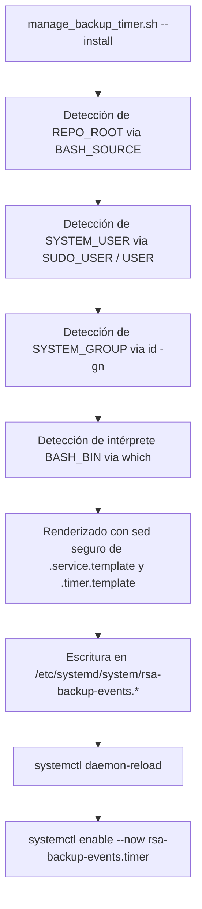

# Gestor de Automatización Systemd (`manage_backup_timer.sh`) — Contexto para Agentes IA

> Script gestor unificado para la instalación, control de estado, ejecución de prueba y desinstalación limpia de temporizadores y servicios `systemd`, diseñado con plantillas agnósticas y resolución dinámica de rutas y usuarios sin valores hardcodeados en el repositorio.

**Ruta**: `services/systemd/manage_backup_timer.sh`  
**Rutas de Archivos Asociados**:
- Plantilla de Servicio: `services/systemd/rsa-backup-events.service.template`
- Plantilla de Temporizador: `services/systemd/rsa-backup-events.timer.template`
- Script Invocado: `scripts/db_sync/backup_events.sh`
- Unidades Generadas: `/etc/systemd/system/rsa-backup-events.{service,timer}`

**LOC**: `manage_backup_timer.sh`: 280 | `service.template`: 20 | `timer.template`: 10  
**Lenguaje/Formato**: Bash (`set -euo pipefail`), Systemd INI  
**Dependencias/Binarios**: `systemctl`, `journalctl`, `sed`, `which`, `id`  
**Proceso**: Utilidad de administración del sistema ejecutada por el operador o agente.

---

## 🎯 Arquitectura de Resolución Dinámica

---

## ⚙️ Comandos y Capacidades

| Acción | Comando | Privilegios | Propósito |
|---|---|---|---|
| **Instalar** | `sudo ./manage_backup_timer.sh --install` | `root` | Renderiza plantillas, copia a `/etc/systemd/system/`, recarga e inicia el timer. |
| **Estado** | `./manage_backup_timer.sh --status` | Usuario | Muestra estado de la unidad timer, última ejecución y cronograma. |
| **Prueba Manual** | `sudo ./manage_backup_timer.sh --run-now` | `root` | Dispara inmediatamente una ejecución sincrónica de `rsa-backup-events.service`. |
| **Logs** | `./manage_backup_timer.sh --logs [-f]` | Usuario | Inspecciona o sigue en tiempo real los registros en `journald`. |
| **Desinstalar** | `sudo ./manage_backup_timer.sh --uninstall` | `root` | Detiene, deshabilita y elimina completamente las unidades del sistema. |
| **Simulación** | `./manage_backup_timer.sh --install --dry-run` | Usuario | Muestra los archivos renderizados sin modificar `/etc/systemd/system/`. |

---

## 🧩 Marcadores de Plantilla Soportados

| Marcador | Variable Sustituida | Descripción |
|---|---|---|
| `@REPO_ROOT@` | `$REPO_ROOT` | Ruta absoluta a la raíz del repositorio. |
| `@SYSTEM_USER@` | `$SYSTEM_USER` | Usuario real detectado (`SUDO_USER` o `$USER`). |
| `@SYSTEM_GROUP@` | `$SYSTEM_GROUP` | Grupo primario del usuario (`id -gn`). |
| `@WORKING_DIR@` | `$REPO_ROOT/scripts/db_sync` | Directorio de trabajo para la ejecución. |
| `@BACKUP_SCRIPT@` | `$REPO_ROOT/scripts/db_sync/backup_events.sh` | Ruta absoluta al script de respaldo. |
| `@ENV_FILE@` | `$REPO_ROOT/services/docker-unified/.env` | Ruta absoluta al archivo de entorno. |
| `@BASH_BIN@` | `$(which bash)` | Intérprete bash del host (`/usr/bin/bash`). |
| `@SCHEDULE_CALENDAR@` | `--time` (default: `*-*-* 02:00:00 UTC`) | Expresión `OnCalendar` de systemd. |
| `@RANDOM_DELAY@` | `--delay` (default: `300`) | Retardo aleatorio en segundos (jitter). |

---

## 🛠️ Resiliencia y Portabilidad

1. **Inmutabilidad en Git**: Las plantillas no contienen rutas locales del host.
2. **Reubicación Instantánea**: Si el directorio del proyecto cambia de ubicación, basta con ejecutar `--uninstall` y `--install` para reconfigurar todo automáticamente.
3. **Persistencia de Timer (`Persistent=true`)**: Garantiza que si el servidor estuvo apagado durante el horario programado (02:00 UTC), la tarea se disparará de inmediato al encender el equipo.
