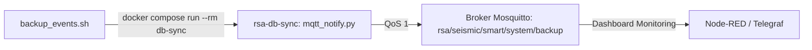

# Notificador MQTT de Respaldos (`mqtt_notify.py` / `rsa-db-sync`) — Contexto para Agentes IA

> Microservicio utilitario y script Python ejecutado bajo demanda dentro del contenedor Docker `rsa-db-sync` para emitir telemetría estructurada JSON del estado de los respaldos al broker MQTT con QoS 1.

**Ruta**: `scripts/db_sync/mqtt_notify.py`  
**Rutas de Archivos Asociados**:
- Dockerfile Contenedor: `scripts/db_sync/Dockerfile`
- Dependencias: `scripts/db_sync/requirements.txt`
- Invocador Host: `scripts/db_sync/backup_events.sh`
- Docker Compose: `services/docker-unified/docker-compose.yml`

**LOC**: `mqtt_notify.py`: 180 | `Dockerfile`: 15 | `requirements.txt`: 3  
**Lenguaje/Formato**: Python 3.11, Dockerfile, JSON  
**Dependencias/Librerías**: `paho-mqtt>=1.6.1`, `python-dotenv>=1.0.0`, `influxdb-client>=1.36.0`  
**Proceso**: Ejecutado de forma efímera mediante `docker compose run --rm db-sync mqtt_notify.py [args]`.

---

## 🎯 Arquitectura y Estructura del Payload



### Estructura del Payload JSON Emitido:

```json
{
  "source": "backup_events",
  "server": "events-oficina",
  "status": "success",
  "timestamp_utc": "2026-08-28T17:05:44Z",
  "snapshot_size_bytes": 55442,
  "csv_size_bytes": 170139,
  "events_count": 424,
  "backup_file": "rsa_events_2026-08-28.tar.gz",
  "drive_path": "gdrive:DIA/Datos Estaciones/RSA-Backups/influxdb",
  "purged_count": 0,
  "duration_s": 11.0,
  "error_message": null
}
```

---

## ⚙️ Argumentos CLI

| Opción | Tipo | Descripción |
|---|---|---|
| `--status` | `success` \| `failure` | Estado final de la operación (requerido). |
| `--events-count` | `int` | Cantidad total de eventos catalogados. |
| `--snapshot-size` | `int` | Tamaño en bytes del archivo comprimido `.tar.gz`. |
| `--csv-size` | `int` | Tamaño en bytes del archivo `.csv`. |
| `--backup-file` | `str` | Nombre del archivo de respaldo generado. |
| `--drive-path` | `str` | Ruta de destino en Google Drive. |
| `--purged-count` | `int` | Cantidad de respaldos antiguos eliminados por rotación. |
| `--duration` | `float` | Duración total de la operación en segundos. |
| `--error-message` | `str` | Detalle del error si `--status failure`. |
| `--server` | `str` | ID del servidor (default: `TELEGRAF_CLIENT_ID`). |
| `--topic` | `str` | Tópico destino (default: `rsa/seismic/smart/system/backup`). |

---

## 🛠️ Resiliencia y Portabilidad

1. **Aislamiento Total**: No requiere dependencias Python en el host; se ejecuta dentro del contenedor `rsa-db-sync` construido a partir de `python:3.11-slim`.
2. **Compatibilidad Paho MQTT v1/v2**: Detecta y soporta tanto `CallbackAPIVersion.VERSION2` como APIs anteriores de `paho-mqtt`.
3. **Publicación Sincrónica y QoS 1**: Utiliza `msg_info.wait_for_publish(timeout=10.0)` asegurando que el mensaje sea entregado y confirmado antes de terminar el contenedor.
