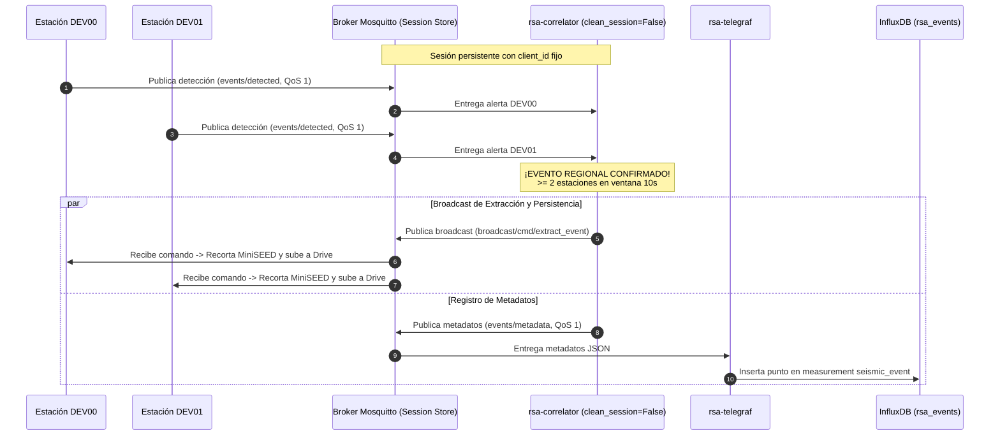

# Correlador Regional de Eventos Sísmicos MQTT — Contexto para Agentes IA

> Servicio daemon en contenedor Docker que realiza análisis temporal en tiempo real de las alertas de eventos detectadas por las estaciones acelerográficas distribuidas, confirma eventos regionales (coincidencia de 2 o más estaciones en 10 segundos), dispara la orden broadcast de extracción masiva, emite los metadatos JSON a InfluxDB vía Telegraf y mantiene sesión persistente MQTT para retención de mensajes ante cortes de energía.

**Ruta del Código**: `scripts/correlator/regional_event_correlator.py`  
**Rutas de Archivos Asociados**:
- Configuración: `scripts/correlator/config.json`
- Dockerfile: `scripts/correlator/Dockerfile`
- Dependencias: `scripts/correlator/requirements.txt`
- Variables de Entorno (Plantilla): `services/docker-unified/.env.example`
- Integración Docker Compose: `services/docker-unified/docker-compose.yml`

**LOC**: `regional_event_correlator.py`: 396 | `config.json`: 25 | `Dockerfile`: 12 | `requirements.txt`: 2  
**Lenguaje/Formato**: Python 3.11, JSON, Dockerfile, YAML  
**Dependencias/Librerías**: `paho-mqtt>=1.6.1`, `python-dotenv>=1.0.0`  
**Proceso**: Servicio contenedorizado (`rsa-correlator`) que forma parte del stack `docker-unified` bajo el perfil `profiles: ["primary"]` en la red `rsa_network`.

---

## 🎯 Objetivo y Filosofía Operativa

El **Correlador Regional** actúa como el validador central de eventos sísmicos en la red:

1. **Suscribe con Sesión Persistente**: Se conecta con un `client_id` estático (`RSA_CORRELATOR_CLIENT_ID`) y `clean_session=False`, suscribiéndose a `rsa/seismic/smart/+/events/detected` con QoS 1. Si el servidor se apaga por cortes de luz, Mosquitto encola las detecciones y las entrega en ráfaga al reconectar.
2. **Filtra y Desduplica**: Agrupa las detecciones recibidas por ventana de 10 segundos y desduplica múltiples alertas generadas por ruido dentro de la misma estación.
3. **Correlaciona**: Al verificar la presencia de $\ge 2$ estaciones distintas dentro de la misma ventana de 10 segundos, declara un **Evento Regional Confirmado**.
4. **Dispara Broadcast**: Determina la detección más temprana (`dt_min`) y publica la orden de extracción masiva en `rsa/seismic/smart/broadcast/cmd/extract_event` con `req_id = corr-YYYYMMDD-HHMMSS` calculado a partir de `dt_min` (ADR-016), ordenando la subida a Drive y el borrado local (`"delete_after_upload": true`).
5. **Emite Metadatos para InfluxDB**: Publica un payload JSON estructurado en `rsa/seismic/smart/events/metadata` con QoS 1 que contiene `event_type: "auto"`, `source: "correlator"`, `event_id` unificado con `dt_min`, `timestamp_utc`, estaciones participantes y probabilidades individuales para su ingesta por Telegraf en InfluxDB.

---

## 🏗️ Diagrama de Secuencia y Arquitectura

---

## ⚙️ Configuración y Variables de Entorno

### Variables de Entorno (`.env`)

- `RSA_CORRELATOR_CLIENT_ID`: Identificador fijo del cliente MQTT (default: `rsa-correlator-primary`).
- `MQTT_BROKER`, `MQTT_PORT`, `MQTT_USERNAME`, `MQTT_PASSWORD`: Credenciales del broker central.

---

## 🛠️ Resiliencia y Arquitectura Multi-Servidor (Fase 5B)

1. **Sesión Persistente (`clean_session=False`)**: Evita la pérdida de alertas sísmicas durante cortes de energía o tareas de mantenimiento en el servidor primario.
2. **Control de Perfiles en Docker Compose**: Asignado a `profiles: ["primary"]`, impidiendo que se ejecuten dos correladores simultáneos si el stack se levanta en un servidor espejo (`home-server`).
3. **QoS 1 en Metadatos y Broadcast**: Garantiza entrega confiable de órdenes y registros en InfluxDB.
