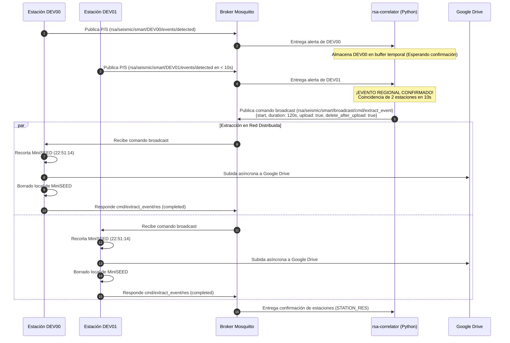

# Correlador Regional de Eventos Sísmicos MQTT — Contexto para Agentes IA

> Servicio daemon en contenedor Docker que realiza análisis temporal en tiempo real de las alertas de eventos detectadas por las estaciones acelerográficas distribuidas, confirma eventos regionales (coincidencia de 2 o más estaciones en 10 segundos) y dispara la orden broadcast de extracción masiva y subida a Google Drive.

**Ruta del Código**: `scripts/correlator/regional_event_correlator.py`
**Rutas de Archivos Asociados**:
- Configuración: `scripts/correlator/config.json`
- Dockerfile: `scripts/correlator/Dockerfile`
- Dependencias: `scripts/correlator/requirements.txt`
- Variables de Entorno (Plantilla): `scripts/correlator/.env.example`
- Integración Docker Compose: `services/docker-unified/docker-compose.yml`

**LOC**: `regional_event_correlator.py`: 338 | `config.json`: 20 | `Dockerfile`: 12 | `requirements.txt`: 2
**Lenguaje/Formato**: Python 3.11, JSON, Dockerfile, YAML
**Dependencias/Librerías**: `paho-mqtt>=1.6.1`, `python-dotenv>=1.0.0`
**Proceso**: Servicio contenedorizado (`rsa-correlator`) que forma parte del stack `docker-unified` en la red `rsa_network`.

---

## 🎯 Objetivo y Filosofía Operativa

En el esquema descentralizado original, cada estación ejecutaba la extracción local e intento de subida a Google Drive de manera autónoma ante cualquier detección individual de fases P/S. Esto producía saturación de almacenamiento e hiper-sensibilidad por ruido en estaciones específicas.

Con este servicio, las estaciones operan en modo pasivo (`"auto_extract": false`, `"auto_upload": false`), enviando únicamente la notificación liviana de alerta en el tópico `events/detected`. El **Correlador Regional** actúa como cerebro de validación de red:

1. **Suscribe**: Escucha las alertas de todas las estaciones en `rsa/seismic/smart/+/events/detected`.
2. **Filtra y Desduplica**: Agrupa las detecciones recibidas por ventana de 10 segundos y desduplica múltiples alertas generadas por ruido dentro de la misma estación.
3. **Correlaciona**: Al verificar la presencia de $\ge 2$ estaciones distintas dentro de la misma ventana de 10 segundos, declara un **Evento Regional Confirmado**.
4. **Dispara Broadcast**: Publica la orden de extracción masiva en el canal `rsa/seismic/smart/broadcast/cmd/extract_event` ordenando la subida a Drive y el borrado local (`"delete_after_upload": true`).

---

## 🏗️ Diagrama de Secuencia y Arquitectura



---

## ⚙️ Configuración y Variables de Entorno

### Configuración (`scripts/correlator/config.json`)

| Parámetro | Tipo | Valor por Defecto | Descripción |
|-----------|------|-------------------|-------------|
| `org` | String | `"rsa"` | Prefijo de organización del árbol de tópicos. |
| `app` | String | `"seismic"` | Aplicación del árbol de tópicos. |
| `cap` | String | `"smart"` | Capacidad del árbol de tópicos. |
| `min_estaciones` | Int | `2` | Número mínimo de estaciones distintas requeridas para confirmar un evento. |
| `ventana_coincidencia_s` | Float | `10.0` | Ventana temporal en segundos para considerar coincidencias entre estaciones. |
| `cooldown_evento_s` | Float | `60.0` | Cooldown del correlador para evitar comandos duplicados por réplicas inmediatas. |
| `ventana_pre_evento_s` | Int | `60` | Segundos de padding anterior al evento para el recorte MiniSEED. |
| `ventana_post_evento_s` | Int | `60` | Segundos de padding posterior al evento para el recorte MiniSEED. |
| `delete_after_upload` | Bool | `true` | Ordena a las estaciones borrar el archivo local tras la subida exitosa. |

### Variables de Entorno (`.env` / Docker Container)

* `MQTT_BROKER`: Host del broker Mosquitto (ej. `174.138.41.251`).
* `MQTT_PORT`: Puerto MQTT (por defecto `1883`).
* `MQTT_USERNAME`: Usuario autenticado del broker.
* `MQTT_PASSWORD`: Contraseña del usuario del broker.

---

## 💻 Estructura del Código (`regional_event_correlator.py`)

### Métodos Clave de la Clase `RegionalEventCorrelator`

* **`iniciar()`**: Configura el cliente Paho-MQTT, establece callbacks, conecta al broker y ejecuta el bucle de polling y mantenimiento del buffer.
* **`_on_message(client, userdata, msg)`**: Procesa mensajes MQTT entrantes. Separa las respuestas de estaciones (`/cmd/extract_event/res`) de las alertas de detección (`/events/detected`).
* **`_procesar_deteccion_estacion(payload)`**: Valida el payload de la alerta y llama a `_actualizar_buffer` y `_evaluar_evento_regional`.
* **`_actualizar_buffer(station_id, dt, phase, prob, raw)`**: Reemplaza o agrega la detección garantizando que una misma estación ruidosa no genere entradas duplicadas en la ventana de 10s.
* **`_limpiar_buffer_antiguo()`**: Purga automáticamente del buffer en memoria cualquier detección con antigüedad superior al doble de la ventana.
* **`_evaluar_evento_regional(dt_referencia)`**: Comprueba si el conteo de estaciones únicas en $[T - 10s, T + 10s]$ es $\ge 2$. Si se cumple y no hay cooldown activo, invoca `_disparar_extraccion_broadcast`.
* **`_disparar_extraccion_broadcast(detecciones, estaciones)`**: Calcula $T_{start}$ a partir de la alerta más temprana, construye el payload JSON con `delete_after_upload: true` y publica en `rsa/seismic/smart/broadcast/cmd/extract_event`.

---

## 🐳 Integración Docker Compose (`services/docker-unified/docker-compose.yml`)

El servicio está integrado como la 4ta unidad del stack unificado:

```yaml
  correlator:
    build:
      context: ../../scripts/correlator
      dockerfile: Dockerfile
    container_name: rsa-correlator
    restart: unless-stopped
    environment:
      - MQTT_BROKER=${MQTT_BROKER}
      - MQTT_PORT=${MQTT_PORT:-1883}
      - MQTT_USERNAME=${MQTT_USERNAME}
      - MQTT_PASSWORD=${MQTT_PASSWORD}
    networks:
      - monitoring
```

### Operación y Monitoreo

```bash
# Arrancar o recompilar el servicio
cd services/docker-unified
docker compose up -d --build correlator

# Ver logs del correlador en tiempo real
docker compose logs -f correlator
```

---

## 🛠️ Buenas Prácticas y Manejo de Errores

1. **Soporte Paho-MQTT v1.x y v2.x**: Utiliza detección condicional de `CallbackAPIVersion.VERSION2` con fallback automático.
2. **Logs Unbuffered**: El Dockerfile ejecuta Python con la bandera `-u` (`python -u regional_event_correlator.py`) para garantizar que la salida de `logging.info` se refleje inmediatamente en los contenedores Docker y `docker compose logs`.
3. **Parada Ordenada**: Captura señales `SIGTERM` y `SIGINT` desconectando limpiamente el loop MQTT antes de cerrar el contenedor.
