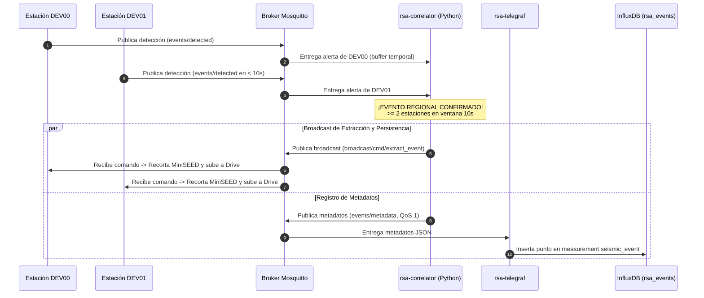

# Correlador Regional de Eventos Sísmicos MQTT — Contexto para Agentes IA

> Servicio daemon en contenedor Docker que realiza análisis temporal en tiempo real de las alertas de eventos detectadas por las estaciones acelerográficas distribuidas, confirma eventos regionales (coincidencia de 2 o más estaciones en 10 segundos), dispara la orden broadcast de extracción masiva y emite los metadatos JSON a InfluxDB vía Telegraf.

**Ruta del Código**: `scripts/correlator/regional_event_correlator.py`
**Rutas de Archivos Asociados**:
- Configuración: `scripts/correlator/config.json`
- Dockerfile: `scripts/correlator/Dockerfile`
- Dependencias: `scripts/correlator/requirements.txt`
- Variables de Entorno (Plantilla): `scripts/correlator/.env.example`
- Integración Docker Compose: `services/docker-unified/docker-compose.yml`

**LOC**: `regional_event_correlator.py`: 391 | `config.json`: 25 | `Dockerfile`: 12 | `requirements.txt`: 2
**Lenguaje/Formato**: Python 3.11, JSON, Dockerfile, YAML
**Dependencias/Librerías**: `paho-mqtt>=1.6.1`, `python-dotenv>=1.0.0`
**Proceso**: Servicio contenedorizado (`rsa-correlator`) que forma parte del stack `docker-unified` en la red `rsa_network`.

---

## 🎯 Objetivo y Filosofía Operativa

El **Correlador Regional** actúa como el validador central de eventos sísmicos en la red:

1. **Suscribe**: Escucha alertas en `rsa/seismic/smart/+/events/detected`.
2. **Filtra y Desduplica**: Agrupa las detecciones recibidas por ventana de 10 segundos y desduplica múltiples alertas generadas por ruido dentro de la misma estación.
3. **Correlaciona**: Al verificar la presencia de $\ge 2$ estaciones distintas dentro de la misma ventana de 10 segundos, declara un **Evento Regional Confirmado**.
4. **Dispara Broadcast**: Determina la detección más temprana (`dt_min`) y publica la orden de extracción masiva en `rsa/seismic/smart/broadcast/cmd/extract_event` con `req_id = corr-YYYYMMDD-HHMMSS` calculado a partir de `dt_min` (ADR-016), ordenando la subida a Drive y el borrado local (`"delete_after_upload": true`).
5. **Emite Metadatos para InfluxDB**: Publica un payload JSON estructurado en `rsa/seismic/smart/events/metadata` con QoS 1 que contiene `event_type: "auto"`, `source: "correlator"`, `event_id` unificado con `dt_min`, `timestamp_utc`, estaciones participantes y probabilidades individuales para su ingesta por Telegraf en InfluxDB.

---

## 🏗️ Diagrama de Secuencia y Arquitectura



---

## ⚙️ Configuración y Tópicos MQTT

### Configuración (`scripts/correlator/config.json`)

```json
{
  "topics": {
    "detections": "{org}/{app}/{cap}/+/events/detected",
    "broadcast_extract": "{org}/{app}/{cap}/broadcast/cmd/extract_event",
    "station_responses": "{org}/{app}/{cap}/+/cmd/extract_event/res",
    "events_metadata": "{org}/{app}/{cap}/events/metadata"
  },
  "correlator": {
    "min_estaciones": 2,
    "ventana_coincidencia_s": 10.0,
    "cooldown_evento_s": 60.0,
    "ventana_pre_evento_s": 60,
    "ventana_post_evento_s": 60,
    "delete_after_upload": true
  }
}
```

---

## 🛠️ Resiliencia y Buenas Prácticas

1. **Prevención de Colisión de `client_id`**: Utiliza `uuid.uuid4().hex[:6]` combinado con `socket.gethostname()` para generar IDs de cliente únicos, evitando reconexiones cíclicas en Mosquitto.
2. **QoS 1 en Publicación de Metadatos**: Garantiza la entrega de metadatos incluso con latencias de red temporales.
3. **Manejo Dinámico de Buffer**: Descarta detecciones con antigüedad mayor a 30s respecto al reloj UTC del sistema para prevenir falsos positivos por paquetes retenidos.
