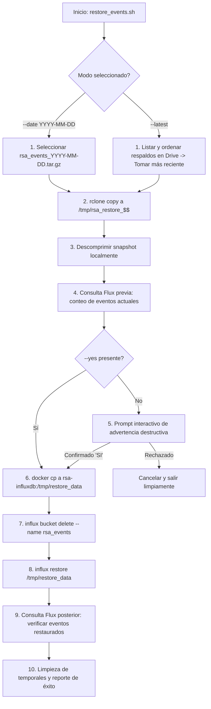

# Protocolo de Restauración InfluxDB (`restore_events.sh`) — Contexto para Agentes IA

> Script Bash interactivo para la descarga de snapshots binarios desde Google Drive, validación de integridad previa, eliminación controlada del bucket `rsa_events` y restauración completa con `influx restore`.

**Ruta**: `scripts/db_sync/restore_events.sh`  
**Rutas de Archivos Asociados**:
- Script de Respaldo: `scripts/db_sync/backup_events.sh`
- Variables de Entorno: `services/docker-unified/.env`

**LOC**: `restore_events.sh`: 168  
**Lenguaje/Formato**: Bash (`set -euo pipefail`), Docker CLI, Influx CLI, rclone, Flux Query  
**Dependencias/Binarios**: `docker`, `rclone`, `tar`, `awk`, `read`  
**Proceso**: Ejecutado interactivamente por el operador o agente en caso de desastre, migración o despliegue de un servidor espejo.

---

## 🎯 Arquitectura y Flujo de Restauración

---

## ⚙️ Argumentos CLI

| Argumento | Requerido | Descripción |
|---|---|---|
| `--latest` | Sí (o `--date`) | Descarga y restaura el archivo más reciente disponible en Google Drive. |
| `--date YYYY-MM-DD` | Sí (o `--latest`) | Descarga y restaura el snapshot de una fecha específica. |
| `--yes`, `-y` | No | Omite la confirmación interactiva para scripts automatizados. |
| `--env-file PATH` | No | Especifica una ruta personalizada para el archivo `.env`. |

---

## 🛠️ Medidas de Seguridad y Control

1. **Aviso Destructivo Explícito**: Imprime la cantidad de eventos actuales que se eliminarán antes de ejecutar la acción destructiva.
2. **Requerimiento de Palabra Clave**: Exige escribir exactamente `'SI'` (en mayúsculas) para proceder en modo interactivo.
3. **Verificación de Conteo Post-Restauración**: Realiza una consulta Flux `count()` para certificar que el catálogo restaurado coincide con el número de eventos esperados.
4. **Limpieza Garantizada**: Manifiesto `trap cleanup EXIT` que remueve los archivos temporales en el host y en el contenedor `/tmp/restore_data`.
