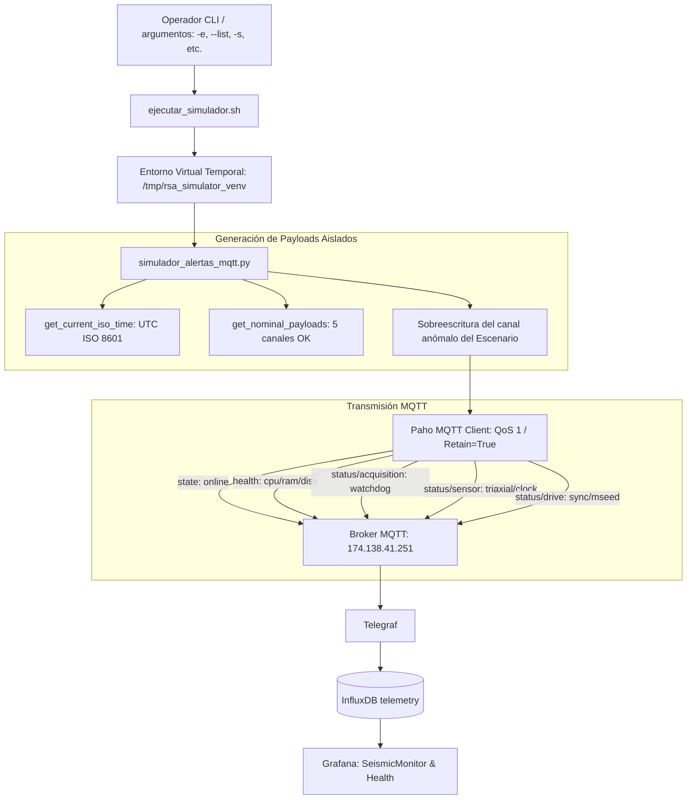

# simulador_alertas_mqtt.py — Contexto para Agentes IA

> Inyector y simulador interactivo de telemetría sintética MQTT basado en Python y Paho MQTT para pruebas de integración y validación visual del stack TIG, garantizando aislamiento estricto de anomalías mediante publicación simultánea de línea base nominal y generación dinámica de marcas de tiempo UTC ISO 8601.

**Ruta**: `scripts/testing/simulador_alertas_mqtt.py`  
**Rutas de Archivos Asociados**:
- Wrapper de Ejecución Aislada: `scripts/testing/ejecutar_simulador.sh`
- Dependencias PIP: `scripts/testing/requirements.txt` (`paho-mqtt>=1.6.1`)

**LOC**: `simulador_alertas_mqtt.py`: 438 | `ejecutar_simulador.sh`: 41 | `requirements.txt`: 1  
**Lenguaje/Formato**: Python 3.11 / Bash / PIP Requirements  
**Dependencias**: `paho-mqtt>=1.6.1`, `argparse`, `json`, `datetime`  
**Proceso**: Ejecución manual o en pruebas controladas mediante `./ejecutar_simulador.sh [opciones]`, el cual orquesta un entorno virtual temporal en `/tmp/rsa_simulator_venv` y garantiza salida limpia mediante `trap cleanup EXIT`.

---

## 🎯 Arquitectura y Mecanismo de Aislamiento de Pruebas

Para validar confiablemente el motor de votación jerárquico de Grafana (`seismic_monitor.json`) y los paneles analíticos de `health.json`, el simulador aborda dos desafíos operativos clave:
1. **Evitar la obsolescencia temporal**: Genera dinámicamente marcas de tiempo en formato ISO 8601 UTC al segundo exacto (`get_current_iso_time()`), satisfaciendo las ventanas móviles de InfluxDB y Telegraf.
2. **Garantía de Aislamiento (Prevención de Traslapes)**: Si el broker retiene un mensaje de error anterior (o si un equipo físico está transmitiendo errores continuos en un tópico específico), inyectar un error en otro canal sin sanear los demás causaría un conflicto en la votación Flux. Por ello, **cada escenario publica simultáneamente los 5 tópicos de la estación**: 4 canales con datos nominales 100% saludables y únicamente 1 canal con la anomalía específica a evaluar.



---

## ⚙️ Modos de Ejecución y Opciones de Línea de Comandos

El script soporta ejecución interactiva paso a paso y ejecución puntual por línea de comandos:

```bash
# Ejecución interactiva guiada (avanza con Enter o número de escenario)
./scripts/testing/ejecutar_simulador.sh

# Ejecutar únicamente el escenario 3 (Falla de Sensor)
./scripts/testing/ejecutar_simulador.sh -e 3

# Listar los 8 escenarios disponibles
./scripts/testing/ejecutar_simulador.sh --list

# Dirigir la simulación a otra estación (ej. DEV0 en lugar de TEST)
./scripts/testing/ejecutar_simulador.sh -s DEV0 -e 4
```

### Argumentos CLI (`argparse`)

| Argumento | Opción Corta | Valor por Defecto | Descripción |
|-----------|:------------:|:-----------------:|-------------|
| `--escenario` | `-e` | `None` (Modo interactivo) | Número de escenario específico a disparar (1 a 8). |
| `--list` | `-l` | `False` | Muestra la lista y descripción de todos los escenarios. |
| `--station` | `-s` | `TEST` | ID de la estación sobre la cual publicar la telemetría. |
| `--broker` | `-b` | `174.138.41.251` (`$MQTT_BROKER`) | Dirección IP o dominio del broker MQTT. |
| `--port` | `-p` | `1883` (`$MQTT_PORT`) | Puerto del broker MQTT. |
| `--user` | `-u` | `rsa` (`$MQTT_USERNAME`) | Usuario de autenticación MQTT. |
| `--password` | `-P` | `RSAiotace2023` (`$MQTT_PASSWORD`) | Contraseña de autenticación MQTT. |

---

## 📋 Escenarios de Prueba Implementados

| ID | Nombre del Escenario | Canal Anómalo | Diagnóstico Esperado | Color en SeismicMonitor |
|:--:|----------------------|:-------------:|:--------------------:|:-----------------------:|
| **1** | Estado Nominal Completo | Ninguno (Todo OK) | `OK` | Verde |
| **2** | Falla de Google Drive | `status/drive` | `Drive` | Amarillo (`semi-dark-yellow`) |
| **3** | Incoherencia Sensor Triaxial | `status/sensor` | `Sensor` | Rojo (`dark-red`) |
| **4** | Pipeline Adquisición Detenido | `status/acquisition` | `Adquisicion` | Rojo (`dark-red`, prioridad alta) |
| **5** | Alerta Memoria RAM Crítica | `telemetry/health` (RAM >90%) | `Memoria` | Naranja (`dark-orange`) |
| **6** | Alerta Espacio en Disco Crítico | `telemetry/health` (Disco >90%) | `Disco` | Naranja (`dark-orange`) |
| **7** | Alerta Temperatura Elevada CPU | `telemetry/health` (Temp >70°C) | `Temperatura` | Naranja (`dark-orange`) |
| **8** | Restauración Final Nominal | Ninguno (Todo OK) | `OK` | Verde |

---

## 🧩 Componentes y Funciones Clave

| Función / Bloque | Descripción |
|------------------|-------------|
| `get_current_iso_time()` | Retorna la marca de tiempo UTC actual formateada como `YYYY-MM-DDTHH:MM:SSZ`. |
| `get_nominal_payloads(station_id, now)` | Construye el diccionario con los 5 payloads de telemetría en estado nominal perfecto. |
| `build_scenario_messages(...)` | Combina los payloads nominales con la sobreescritura específica del canal anómalo bajo prueba. |
| `publish_mqtt_messages(...)` | Gestiona conexión, autenticación, publicación concurrente con QoS 1 y desconexión limpia del cliente Paho. |
| `modo_interactivo(...)` | Bucle de control en terminal que permite al operador pausar, inspeccionar Grafana y avanzar con `Enter`. |
| `ejecutar_simulador.sh` | Wrapper Bash con `trap cleanup EXIT` que crea el venv si no existe, instala librerías y lo desactiva automáticamente. |

---

## ⚠️ Limitaciones Conocidas / TODOs

- **Sobreescritura de Retain**: Los mensajes se publican con el flag `retain=True` para garantizar que InfluxDB y Telegraf capturen el estado de inmediato. Tras finalizar pruebas en una estación operativa real, **debe ejecutarse el escenario 8 (Restauración Nominal)** para no dejar alertas retenidas en el broker.
- **Acceso al Broker**: Requiere conectividad TCP saliente directa al puerto 1883 del broker MQTT desde la máquina de ejecución.
