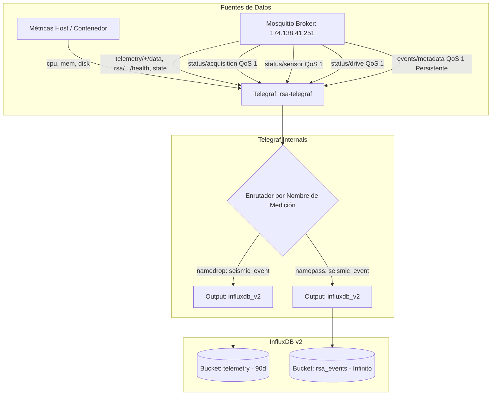

# telegraf.conf — Contexto para Agentes IA

> Colector y despachador de métricas de telemetría de sistema y telemetría distribuida MQTT (estado de conectividad, salud de hardware, watchdog de adquisición, integridad triaxial de sensores, sincronización de Google Drive y catálogo de eventos sísmicos) con enrutamiento dual a buckets InfluxDB v2 (`telemetry` y `rsa_events`).

**Ruta**: `services/docker-unified/telegraf.conf`  
**LOC**: 206 | **Lenguaje/Formato**: TOML (Telegraf Agent Config) | **Dependencias**: `telegraf:1.28`, `influxdb:2.7`, Mosquitto MQTT Broker  
**Proceso**: Daemon Telegraf ejecutado dentro del contenedor Docker `rsa-telegraf` conectado a la red externa `rsa_network`.

---

## 🎯 Arquitectura y Flujo de Ingesta

Telegraf opera como el bus central de ingesta hacia InfluxDB v2. Gestiona tres familias de plugins:
1. **Métricas del Sistema Local**: CPU, RAM, disco, memoria swap, kernel y procesos del anfitrión/contenedor.
2. **Telemetría Distribuida MQTT**: Cinco consumidores MQTT segmentados por propósito y QoS:
   - Consumidor multipropósito (QoS 0) con `topic_parsing` para telemetría general de estaciones (`state`, `health`, `heartbeat`, `events`).
   - Tres consumidores dedicados (QoS 1) para subsistemas especializados de acelerógrafos:
     - `station_acquisition`: Watchdog del Ring Buffer (`status/acquisition`).
     - `station_sensor`: Verificación triaxial en reposo y reloj GPS/NTP (`status/sensor`).
     - `station_drive`: Estado de sincronización y archivos retenidos (`status/drive`).
   - Consumidor de catálogo de eventos sísmicos (`seismic_event`, QoS 1, sesión persistente con `client_id`).
3. **Enrutamiento Dual a InfluxDB v2**:
   - Bucket `telemetry` (retención de 90 días): Ingesta toda la telemetría excluyendo eventos sísmicos (`namedrop = ["seismic_event"]`).
   - Bucket `rsa_events` (retención infinita): Ingesta exclusivamente el catálogo de eventos (`namepass = ["seismic_event"]`).

---

## ⚙️ Configuraciones y Variables de Entorno

| Variable / Parámetro | Valor / Origen | Propósito |
|----------------------|----------------|-----------|
| `interval` | `10s` | Periodo estándar de muestreo de inputs. |
| `flush_interval` | `5s` | Frecuencia de vaciado de buffers hacia InfluxDB. |
| `metric_buffer_limit`| `10000` | Límite de retención en memoria ante caídas temporales de InfluxDB. |
| `${INFLUXDB_TOKEN}` | `.env` | Token de autenticación con permisos de escritura. |
| `${INFLUXDB_ORG}` | `.env` | Organización configurada en InfluxDB (`rsa`). |
| `${INFLUXDB_BUCKET}` | `telemetry` | Bucket para métricas temporales de series de tiempo. |
| `${INFLUXDB_EVENTS_BUCKET}` | `rsa_events` | Bucket para catálogo permanente de eventos sísmicos. |
| `${MQTT_BROKER}` | `174.138.41.251` | Host del broker MQTT público/privado. |
| `${MQTT_USERNAME}` / `${MQTT_PASSWORD}` | `.env` | Credenciales de autenticación MQTT. |
| `${TELEGRAF_CLIENT_ID}` | `events-oficina` | Identificador de cliente para la sesión persistente de eventos. |

---

## 🧩 Consumidores MQTT y Plugins Clave

| Plugin | Tópicos Suscritos | Formato / Medición | Tags / Campos Clave |
|--------|-------------------|--------------------|---------------------|
| `inputs.cpu`, `mem`, `disk` | N/A (Métricas del host) | Métricas estándar Telegraf | Métricas de rendimiento del servidor local. |
| `inputs.mqtt_consumer` (General) | `telemetry/+/data`, `rsa/seismic/smart/+/telemetry/*` | `json` con `topic_parsing` (`_/_/_/station_id/_/data_type`) | Extrae `station_id` y `data_type` dinámicamente; campos: `status`, `throttled`, etc. |
| `inputs.mqtt_consumer` (Acquisition) | `rsa/seismic/smart/+/status/acquisition` | `name_override = "station_acquisition"` | Tags: `station_id`, `status`, `reason`. Campos: `age_seconds`, `threshold_seconds`. |
| `inputs.mqtt_consumer` (Sensor) | `rsa/seismic/smart/+/status/sensor` | `name_override = "station_sensor"` | Tags: `station_id`, `status`, `clock_source`, `reason`. Campos: `ax`, `ay`, `az`, `clock_error`. |
| `inputs.mqtt_consumer` (Drive) | `rsa/seismic/smart/+/status/drive` | `name_override = "station_drive"` | Tags: `station_id`, `status`, `reason`. Campos: `pending_mseed`, `failed_uploads_protected`, `free_disk_percent`. |
| `inputs.mqtt_consumer` (Eventos) | `rsa/seismic/smart/events/metadata` | `json_v2` con `name_override = "seismic_event"` | Tags: `event_type`, `source`, `event_id`. Campos: `stations`, `n_stations`, `duration_s`. Sesión persistente. |

---

## ⚠️ Limitaciones Conocidas / TODOs

- **Estructura de Tópicos Rígida**: El plugin `topic_parsing` depende de que los tópicos sigan exactamente la jerarquía `rsa/seismic/smart/{station_id}/...`. Variaciones de longitud de ruta requieren reconfiguración del esquema de parsing.
- **Buffer de Telemetría Transitoria**: Los consumidores de telemetría de salud y estado usan QoS 0/1 sin sesión persistente para evitar la acumulación masiva de telemetría obsoleta en el broker tras desconexiones prolongadas del servidor central. Solo `seismic_event` mantiene sesión persistente.
- **Tipado de Cadenas**: Campos como `status`, `reason`, `last_event` y `throttled` deben declararse explícitamente en `json_string_fields` o `tag_keys` para evitar que el parser JSON intente inferir tipos numéricos erróneos.
